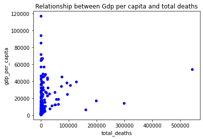

The rise of covid-19 in 2020 has set scene to some very unprecedented times in this world. Each and every country in the world has experienced the devastating impact that covid-19 has caused on the physical as well as the mental well being of the general population. The following piece of code allows us to see the ultimate damage caused by covid-19;deaths


```python
import pandas as pd
import matplotlib.pyplot as plt
import numpy as np
import plotly.express as px
df = pd.read_csv (r'C:\BEE2032\owid-covid-data.csv')
data_with_index = df.set_index("iso_code")
data_with_index

data_with_index = data_with_index.drop(["OWID_EUR","OWID_ASI","OWID_OCE","OWID_EUN","OWID_NAM","OWID_SAM","OWID_AFR","OWID_WRL"])
top10confirmed=pd.DataFrame(data_with_index.groupby('location')['new_deaths'].sum().nlargest(10).sort_values(ascending = False))
px.scatter(top10confirmed, x = top10confirmed.index, y = 'new_deaths', size = 'new_deaths', size_max = 120,
               color = top10confirmed.index, title = 'Top 10 Countries with the most total deaths')

```


<div>                            <div id="5d140133-a0c5-4f69-ba47-6b6525ac57f5" class="plotly-graph-div" style="height:525px; width:100%;"></div>            <script type="text/javascript">                require(["plotly"], function(Plotly) {                    window.PLOTLYENV=window.PLOTLYENV || {};                                    if (document.getElementById("5d140133-a0c5-4f69-ba47-6b6525ac57f5")) {                    Plotly.newPlot(                        "5d140133-a0c5-4f69-ba47-6b6525ac57f5",                        [{"hovertemplate": "location=%{x}<br>new_deaths=%{marker.size}<extra></extra>", "legendgroup": "United States", "marker": {"color": "#636efa", "size": [543843.0], "sizemode": "area", "sizeref": 37.766875, "symbol": "circle"}, "mode": "markers", "name": "United States", "orientation": "v", "showlegend": true, "type": "scatter", "x": ["United States"], "xaxis": "x", "y": [543843.0], "yaxis": "y"}, {"hovertemplate": "location=%{x}<br>new_deaths=%{marker.size}<extra></extra>", "legendgroup": "Brazil", "marker": {"color": "#EF553B", "size": [298676.0], "sizemode": "area", "sizeref": 37.766875, "symbol": "circle"}, "mode": "markers", "name": "Brazil", "orientation": "v", "showlegend": true, "type": "scatter", "x": ["Brazil"], "xaxis": "x", "y": [298676.0], "yaxis": "y"}, {"hovertemplate": "location=%{x}<br>new_deaths=%{marker.size}<extra></extra>", "legendgroup": "Mexico", "marker": {"color": "#00cc96", "size": [199048.0], "sizemode": "area", "sizeref": 37.766875, "symbol": "circle"}, "mode": "markers", "name": "Mexico", "orientation": "v", "showlegend": true, "type": "scatter", "x": ["Mexico"], "xaxis": "x", "y": [199048.0], "yaxis": "y"}, {"hovertemplate": "location=%{x}<br>new_deaths=%{marker.size}<extra></extra>", "legendgroup": "India", "marker": {"color": "#ab63fa", "size": [160441.0], "sizemode": "area", "sizeref": 37.766875, "symbol": "circle"}, "mode": "markers", "name": "India", "orientation": "v", "showlegend": true, "type": "scatter", "x": ["India"], "xaxis": "x", "y": [160441.0], "yaxis": "y"}, {"hovertemplate": "location=%{x}<br>new_deaths=%{marker.size}<extra></extra>", "legendgroup": "United Kingdom", "marker": {"color": "#FFA15A", "size": [126523.0], "sizemode": "area", "sizeref": 37.766875, "symbol": "circle"}, "mode": "markers", "name": "United Kingdom", "orientation": "v", "showlegend": true, "type": "scatter", "x": ["United Kingdom"], "xaxis": "x", "y": [126523.0], "yaxis": "y"}, {"hovertemplate": "location=%{x}<br>new_deaths=%{marker.size}<extra></extra>", "legendgroup": "Italy", "marker": {"color": "#19d3f3", "size": [105879.0], "sizemode": "area", "sizeref": 37.766875, "symbol": "circle"}, "mode": "markers", "name": "Italy", "orientation": "v", "showlegend": true, "type": "scatter", "x": ["Italy"], "xaxis": "x", "y": [105879.0], "yaxis": "y"}, {"hovertemplate": "location=%{x}<br>new_deaths=%{marker.size}<extra></extra>", "legendgroup": "Russia", "marker": {"color": "#FF6692", "size": [94231.0], "sizemode": "area", "sizeref": 37.766875, "symbol": "circle"}, "mode": "markers", "name": "Russia", "orientation": "v", "showlegend": true, "type": "scatter", "x": ["Russia"], "xaxis": "x", "y": [94231.0], "yaxis": "y"}, {"hovertemplate": "location=%{x}<br>new_deaths=%{marker.size}<extra></extra>", "legendgroup": "France", "marker": {"color": "#B6E880", "size": [93064.0], "sizemode": "area", "sizeref": 37.766875, "symbol": "circle"}, "mode": "markers", "name": "France", "orientation": "v", "showlegend": true, "type": "scatter", "x": ["France"], "xaxis": "x", "y": [93064.0], "yaxis": "y"}, {"hovertemplate": "location=%{x}<br>new_deaths=%{marker.size}<extra></extra>", "legendgroup": "Germany", "marker": {"color": "#FF97FF", "size": [75255.0], "sizemode": "area", "sizeref": 37.766875, "symbol": "circle"}, "mode": "markers", "name": "Germany", "orientation": "v", "showlegend": true, "type": "scatter", "x": ["Germany"], "xaxis": "x", "y": [75255.0], "yaxis": "y"}, {"hovertemplate": "location=%{x}<br>new_deaths=%{marker.size}<extra></extra>", "legendgroup": "Spain", "marker": {"color": "#FECB52", "size": [73744.0], "sizemode": "area", "sizeref": 37.766875, "symbol": "circle"}, "mode": "markers", "name": "Spain", "orientation": "v", "showlegend": true, "type": "scatter", "x": ["Spain"], "xaxis": "x", "y": [73744.0], "yaxis": "y"}],                        {"legend": {"itemsizing": "constant", "title": {"text": "location"}, "tracegroupgap": 0}, "template": {"data": {"bar": [{"error_x": {"color": "#2a3f5f"}, "error_y": {"color": "#2a3f5f"}, "marker": {"line": {"color": "#E5ECF6", "width": 0.5}}, "type": "bar"}], "barpolar": [{"marker": {"line": {"color": "#E5ECF6", "width": 0.5}}, "type": "barpolar"}], "carpet": [{"aaxis": {"endlinecolor": "#2a3f5f", "gridcolor": "white", "linecolor": "white", "minorgridcolor": "white", "startlinecolor": "#2a3f5f"}, "baxis": {"endlinecolor": "#2a3f5f", "gridcolor": "white", "linecolor": "white", "minorgridcolor": "white", "startlinecolor": "#2a3f5f"}, "type": "carpet"}], "choropleth": [{"colorbar": {"outlinewidth": 0, "ticks": ""}, "type": "choropleth"}], "contour": [{"colorbar": {"outlinewidth": 0, "ticks": ""}, "colorscale": [[0.0, "#0d0887"], [0.1111111111111111, "#46039f"], [0.2222222222222222, "#7201a8"], [0.3333333333333333, "#9c179e"], [0.4444444444444444, "#bd3786"], [0.5555555555555556, "#d8576b"], [0.6666666666666666, "#ed7953"], [0.7777777777777778, "#fb9f3a"], [0.8888888888888888, "#fdca26"], [1.0, "#f0f921"]], "type": "contour"}], "contourcarpet": [{"colorbar": {"outlinewidth": 0, "ticks": ""}, "type": "contourcarpet"}], "heatmap": [{"colorbar": {"outlinewidth": 0, "ticks": ""}, "colorscale": [[0.0, "#0d0887"], [0.1111111111111111, "#46039f"], [0.2222222222222222, "#7201a8"], [0.3333333333333333, "#9c179e"], [0.4444444444444444, "#bd3786"], [0.5555555555555556, "#d8576b"], [0.6666666666666666, "#ed7953"], [0.7777777777777778, "#fb9f3a"], [0.8888888888888888, "#fdca26"], [1.0, "#f0f921"]], "type": "heatmap"}], "heatmapgl": [{"colorbar": {"outlinewidth": 0, "ticks": ""}, "colorscale": [[0.0, "#0d0887"], [0.1111111111111111, "#46039f"], [0.2222222222222222, "#7201a8"], [0.3333333333333333, "#9c179e"], [0.4444444444444444, "#bd3786"], [0.5555555555555556, "#d8576b"], [0.6666666666666666, "#ed7953"], [0.7777777777777778, "#fb9f3a"], [0.8888888888888888, "#fdca26"], [1.0, "#f0f921"]], "type": "heatmapgl"}], "histogram": [{"marker": {"colorbar": {"outlinewidth": 0, "ticks": ""}}, "type": "histogram"}], "histogram2d": [{"colorbar": {"outlinewidth": 0, "ticks": ""}, "colorscale": [[0.0, "#0d0887"], [0.1111111111111111, "#46039f"], [0.2222222222222222, "#7201a8"], [0.3333333333333333, "#9c179e"], [0.4444444444444444, "#bd3786"], [0.5555555555555556, "#d8576b"], [0.6666666666666666, "#ed7953"], [0.7777777777777778, "#fb9f3a"], [0.8888888888888888, "#fdca26"], [1.0, "#f0f921"]], "type": "histogram2d"}], "histogram2dcontour": [{"colorbar": {"outlinewidth": 0, "ticks": ""}, "colorscale": [[0.0, "#0d0887"], [0.1111111111111111, "#46039f"], [0.2222222222222222, "#7201a8"], [0.3333333333333333, "#9c179e"], [0.4444444444444444, "#bd3786"], [0.5555555555555556, "#d8576b"], [0.6666666666666666, "#ed7953"], [0.7777777777777778, "#fb9f3a"], [0.8888888888888888, "#fdca26"], [1.0, "#f0f921"]], "type": "histogram2dcontour"}], "mesh3d": [{"colorbar": {"outlinewidth": 0, "ticks": ""}, "type": "mesh3d"}], "parcoords": [{"line": {"colorbar": {"outlinewidth": 0, "ticks": ""}}, "type": "parcoords"}], "pie": [{"automargin": true, "type": "pie"}], "scatter": [{"marker": {"colorbar": {"outlinewidth": 0, "ticks": ""}}, "type": "scatter"}], "scatter3d": [{"line": {"colorbar": {"outlinewidth": 0, "ticks": ""}}, "marker": {"colorbar": {"outlinewidth": 0, "ticks": ""}}, "type": "scatter3d"}], "scattercarpet": [{"marker": {"colorbar": {"outlinewidth": 0, "ticks": ""}}, "type": "scattercarpet"}], "scattergeo": [{"marker": {"colorbar": {"outlinewidth": 0, "ticks": ""}}, "type": "scattergeo"}], "scattergl": [{"marker": {"colorbar": {"outlinewidth": 0, "ticks": ""}}, "type": "scattergl"}], "scattermapbox": [{"marker": {"colorbar": {"outlinewidth": 0, "ticks": ""}}, "type": "scattermapbox"}], "scatterpolar": [{"marker": {"colorbar": {"outlinewidth": 0, "ticks": ""}}, "type": "scatterpolar"}], "scatterpolargl": [{"marker": {"colorbar": {"outlinewidth": 0, "ticks": ""}}, "type": "scatterpolargl"}], "scatterternary": [{"marker": {"colorbar": {"outlinewidth": 0, "ticks": ""}}, "type": "scatterternary"}], "surface": [{"colorbar": {"outlinewidth": 0, "ticks": ""}, "colorscale": [[0.0, "#0d0887"], [0.1111111111111111, "#46039f"], [0.2222222222222222, "#7201a8"], [0.3333333333333333, "#9c179e"], [0.4444444444444444, "#bd3786"], [0.5555555555555556, "#d8576b"], [0.6666666666666666, "#ed7953"], [0.7777777777777778, "#fb9f3a"], [0.8888888888888888, "#fdca26"], [1.0, "#f0f921"]], "type": "surface"}], "table": [{"cells": {"fill": {"color": "#EBF0F8"}, "line": {"color": "white"}}, "header": {"fill": {"color": "#C8D4E3"}, "line": {"color": "white"}}, "type": "table"}]}, "layout": {"annotationdefaults": {"arrowcolor": "#2a3f5f", "arrowhead": 0, "arrowwidth": 1}, "autotypenumbers": "strict", "coloraxis": {"colorbar": {"outlinewidth": 0, "ticks": ""}}, "colorscale": {"diverging": [[0, "#8e0152"], [0.1, "#c51b7d"], [0.2, "#de77ae"], [0.3, "#f1b6da"], [0.4, "#fde0ef"], [0.5, "#f7f7f7"], [0.6, "#e6f5d0"], [0.7, "#b8e186"], [0.8, "#7fbc41"], [0.9, "#4d9221"], [1, "#276419"]], "sequential": [[0.0, "#0d0887"], [0.1111111111111111, "#46039f"], [0.2222222222222222, "#7201a8"], [0.3333333333333333, "#9c179e"], [0.4444444444444444, "#bd3786"], [0.5555555555555556, "#d8576b"], [0.6666666666666666, "#ed7953"], [0.7777777777777778, "#fb9f3a"], [0.8888888888888888, "#fdca26"], [1.0, "#f0f921"]], "sequentialminus": [[0.0, "#0d0887"], [0.1111111111111111, "#46039f"], [0.2222222222222222, "#7201a8"], [0.3333333333333333, "#9c179e"], [0.4444444444444444, "#bd3786"], [0.5555555555555556, "#d8576b"], [0.6666666666666666, "#ed7953"], [0.7777777777777778, "#fb9f3a"], [0.8888888888888888, "#fdca26"], [1.0, "#f0f921"]]}, "colorway": ["#636efa", "#EF553B", "#00cc96", "#ab63fa", "#FFA15A", "#19d3f3", "#FF6692", "#B6E880", "#FF97FF", "#FECB52"], "font": {"color": "#2a3f5f"}, "geo": {"bgcolor": "white", "lakecolor": "white", "landcolor": "#E5ECF6", "showlakes": true, "showland": true, "subunitcolor": "white"}, "hoverlabel": {"align": "left"}, "hovermode": "closest", "mapbox": {"style": "light"}, "paper_bgcolor": "white", "plot_bgcolor": "#E5ECF6", "polar": {"angularaxis": {"gridcolor": "white", "linecolor": "white", "ticks": ""}, "bgcolor": "#E5ECF6", "radialaxis": {"gridcolor": "white", "linecolor": "white", "ticks": ""}}, "scene": {"xaxis": {"backgroundcolor": "#E5ECF6", "gridcolor": "white", "gridwidth": 2, "linecolor": "white", "showbackground": true, "ticks": "", "zerolinecolor": "white"}, "yaxis": {"backgroundcolor": "#E5ECF6", "gridcolor": "white", "gridwidth": 2, "linecolor": "white", "showbackground": true, "ticks": "", "zerolinecolor": "white"}, "zaxis": {"backgroundcolor": "#E5ECF6", "gridcolor": "white", "gridwidth": 2, "linecolor": "white", "showbackground": true, "ticks": "", "zerolinecolor": "white"}}, "shapedefaults": {"line": {"color": "#2a3f5f"}}, "ternary": {"aaxis": {"gridcolor": "white", "linecolor": "white", "ticks": ""}, "baxis": {"gridcolor": "white", "linecolor": "white", "ticks": ""}, "bgcolor": "#E5ECF6", "caxis": {"gridcolor": "white", "linecolor": "white", "ticks": ""}}, "title": {"x": 0.05}, "xaxis": {"automargin": true, "gridcolor": "white", "linecolor": "white", "ticks": "", "title": {"standoff": 15}, "zerolinecolor": "white", "zerolinewidth": 2}, "yaxis": {"automargin": true, "gridcolor": "white", "linecolor": "white", "ticks": "", "title": {"standoff": 15}, "zerolinecolor": "white", "zerolinewidth": 2}}}, "title": {"text": "Top 10 Countries with the most total deaths"}, "xaxis": {"anchor": "y", "categoryarray": ["United States", "Brazil", "Mexico", "India", "United Kingdom", "Italy", "Russia", "France", "Germany", "Spain"], "categoryorder": "array", "domain": [0.0, 1.0], "title": {"text": "location"}}, "yaxis": {"anchor": "x", "domain": [0.0, 1.0], "title": {"text": "new_deaths"}}},                        {"responsive": true}                    ).then(function(){

var gd = document.getElementById('5d140133-a0c5-4f69-ba47-6b6525ac57f5');
var x = new MutationObserver(function (mutations, observer) {{
        var display = window.getComputedStyle(gd).display;
        if (!display || display === 'none') {{
            console.log([gd, 'removed!']);
            Plotly.purge(gd);
            observer.disconnect();
        }}
}});

// Listen for the removal of the full notebook cells
var notebookContainer = gd.closest('#notebook-container');
if (notebookContainer) {{
    x.observe(notebookContainer, {childList: true});
}}

// Listen for the clearing of the current output cell
var outputEl = gd.closest('.output');
if (outputEl) {{
    x.observe(outputEl, {childList: true});
}}

                        })                };                });            </script>        </div>


As one can see, the most affected countries here are the United States, Brazil and Mexico. The size of each circle reperesents the magnitude of the deaths in these countries. With many previous epidemics,some of the worst affected countries were countries with the least resources, which could could be measured using factors such as GDP, which can be said to be a measure of how many resources a country has got. However, in the above plot, except Brazil,India and Mexico all the other countries are MEDC'S, which are more economically developed countries. This suggests that there are some other factors affecting deaths related to Covid-19, as in theory most of the countries displayed in the graph should have the hospital resources and the infrastructure available to deal with the epidemic better. It can also bee seen that 60% of the worst affected countries belong in Europe, which is an interesting factor to look at as well. To explore more on the correlation between GDP and Covid-19 deaths.


```python
df_gdp=pd.DataFrame(data_with_index.groupby('location')['gdp_per_capita','total_deaths'].max())
df_gdp
#df_gdp
ax1=df_gdp.plot.scatter(x='total_deaths',y='gdp_per_capita',color='b')
plt.title('Relationship between Gdp per capita and total deaths')
```


    Text(0.5, 1.0, 'Relationship between Gdp per capita and total deaths')





```python
df_gdp.corr()
```


<div>
<style scoped>
    .dataframe tbody tr th:only-of-type {
        vertical-align: middle;
    }

    .dataframe tbody tr th {
        vertical-align: top;
    }

    .dataframe thead th {
        text-align: right;
    }
</style>
<table border="1" class="dataframe">
  <thead>
    <tr style="text-align: right;">
      <th></th>
      <th>gdp_per_capita</th>
      <th>total_deaths</th>
    </tr>
  </thead>
  <tbody>
    <tr>
      <td>gdp_per_capita</td>
      <td>1.000000</td>
      <td>0.149351</td>
    </tr>
    <tr>
      <td>total_deaths</td>
      <td>0.149351</td>
      <td>1.000000</td>
    </tr>
  </tbody>
</table>
</div>


The above 2 pieces of data shows that there is a lack of correlation between total deaths and gdp. For there to have been correlation, the graph would have shown an elliptical shape. The data points are shown to be scattered, which suggets a lack of meaningful relationship between gdp and total deaths. I deceided to drop countries who had either the value of gdp missing or total deaths missing or both missing. This is to prevent any skewness in my data or any outlier, although one can see the presence of a couple of outlier in my scatter graph. The low correlation coeffeicent also point out to a lack of correlation, with a value of 0.8-1 being required to have a strong positive correlation. This shows that deaths caused by Covid-19 were more influenced by factors other than resources, or that it cannot be prevented by using a country's resources alone. This may point out to more social issues linking to the distress that this disease can cause. Thus, I will next look at how the HDI of every country is linked to the numebr of deaths caused by covid-19. The HDI is a summary measure of average achievement in key dimension of human developement. This includes factors such as life expectancy, being knowledgeable and having a decent standard of living. 


```python
HDI=data_with_index[['human_development_index','location']]
HDI = HDI[~ HDI.duplicated()]
HDI.dropna()
HDI.nlargest(10,'human_development_index')
#HDI.human_development_index.astype(int)
#HDI=HDI.sort_values(by='human_development_index', ascending=True )
#ax1 = HDI.plot.scatter(x='human_development_index',
                     # y='location',
                     # c='DarkBlue')

```


<div>
<style scoped>
    .dataframe tbody tr th:only-of-type {
        vertical-align: middle;
    }

    .dataframe tbody tr th {
        vertical-align: top;
    }

    .dataframe thead th {
        text-align: right;
    }
</style>
<table border="1" class="dataframe">
  <thead>
    <tr style="text-align: right;">
      <th></th>
      <th>human_development_index</th>
      <th>location</th>
    </tr>
    <tr>
      <th>iso_code</th>
      <th></th>
      <th></th>
    </tr>
  </thead>
  <tbody>
    <tr>
      <td>NOR</td>
      <td>0.957</td>
      <td>Norway</td>
    </tr>
    <tr>
      <td>IRL</td>
      <td>0.955</td>
      <td>Ireland</td>
    </tr>
    <tr>
      <td>CHE</td>
      <td>0.955</td>
      <td>Switzerland</td>
    </tr>
    <tr>
      <td>HKG</td>
      <td>0.949</td>
      <td>Hong Kong</td>
    </tr>
    <tr>
      <td>ISL</td>
      <td>0.949</td>
      <td>Iceland</td>
    </tr>
    <tr>
      <td>DEU</td>
      <td>0.947</td>
      <td>Germany</td>
    </tr>
    <tr>
      <td>SWE</td>
      <td>0.945</td>
      <td>Sweden</td>
    </tr>
    <tr>
      <td>AUS</td>
      <td>0.944</td>
      <td>Australia</td>
    </tr>
    <tr>
      <td>NLD</td>
      <td>0.944</td>
      <td>Netherlands</td>
    </tr>
    <tr>
      <td>DNK</td>
      <td>0.940</td>
      <td>Denmark</td>
    </tr>
  </tbody>
</table>
</div>


The list above shows the 10 countries who are said to have the highest HDI. Out of these countries, only Germany and Sweden have had bad ramifications due to Covid-19, with Germany appearing in the list of the top 10 countries with the most deaths. This suggests an explotary link between HDI and Covid-19 deaths. However, as shown above a lot of countries with high HDI's have been inversely affected. Another way in which deaths due to covid-19 have been increased are due to the action of the government. The government is a key entity in this situation, as they have decided to set laws and regulations that in theory would have best presented the amount of deaths being reduced.


```python
df2 = pd.read_csv(r'C:\BEE2032\WHO-COVID-19-global-data.csv', encoding = 'ISO-8859-1')
df2['Date_reported'] = pd.to_datetime(df2['Date_reported'])
```


```python
time_series_us = df2['Country'] == ('United States of America')
time_series_us = df2[time_series_us]
time_series_brazil = df2['Country'] == ('Brazil')
time_series_brazil = df2[time_series_brazil]
time_series_india = df2['Country'] == ('India')
time_series_india = df2[time_series_india]
time_series_britain = df2['Country'] == ('The United Kingdom')
time_series_britain = df2[time_series_britain]
```


```python
import plotly.graph_objects as go
fig = go.Figure()

fig.add_trace(go.Line(x = time_series_us['Date_reported'], y = time_series_us['Cumulative_cases'], name = 'USA'))
fig.add_trace(go.Line(x = time_series_brazil['Date_reported'], y = time_series_brazil['Cumulative_cases'], name = 'Brazil'))
fig.add_trace(go.Line(x = time_series_india['Date_reported'], y = time_series_india['Cumulative_cases'], name = 'India'))
fig.add_trace(go.Line(x = time_series_britain['Date_reported'], y = time_series_britain['Cumulative_cases'], name = 'Britain'))

fig.update_layout(title = 'Time Series of Most Affected countries"s Cumulative Cases')

fig.show()
```


<div>                            <div id="a9e40f54-42ff-4dff-86c0-1bc17a7ede4b" class="plotly-graph-div" style="height:525px; width:100%;"></div>            <script type="text/javascript">                require(["plotly"], function(Plotly) {                    window.PLOTLYENV=window.PLOTLYENV || {};                                    if (document.getElementById("a9e40f54-42ff-4dff-86c0-1bc17a7ede4b")) {                    Plotly.newPlot(                        "a9e40f54-42ff-4dff-86c0-1bc17a7ede4b",                        [{"name": "USA", "type": "scatter", "x": ["2020-03-01T00:00:00", "2020-04-01T00:00:00", "2020-05-01T00:00:00", "2020-06-01T00:00:00", "2020-07-01T00:00:00", "2020-08-01T00:00:00", "2020-09-01T00:00:00", "2020-10-01T00:00:00", "2020-11-01T00:00:00", "2020-12-01T00:00:00", "2020-01-13T00:00:00", "2020-01-14T00:00:00", "2020-01-15T00:00:00", "2020-01-16T00:00:00", "2020-01-17T00:00:00", "2020-01-18T00:00:00", "2020-01-19T00:00:00", "2020-01-20T00:00:00", "2020-01-21T00:00:00", "2020-01-22T00:00:00", "2020-01-23T00:00:00", "2020-01-24T00:00:00", "2020-01-25T00:00:00", "2020-01-26T00:00:00", "2020-01-27T00:00:00", "2020-01-28T00:00:00", "2020-01-29T00:00:00", "2020-01-30T00:00:00", "2020-01-31T00:00:00", "2020-01-02T00:00:00", "2020-02-02T00:00:00", "2020-03-02T00:00:00", "2020-04-02T00:00:00", "2020-05-02T00:00:00", "2020-06-02T00:00:00", "2020-07-02T00:00:00", "2020-08-02T00:00:00", "2020-09-02T00:00:00", "2020-10-02T00:00:00", "2020-11-02T00:00:00", "2020-12-02T00:00:00", "2020-02-13T00:00:00", "2020-02-14T00:00:00", "2020-02-15T00:00:00", "2020-02-16T00:00:00", "2020-02-17T00:00:00", "2020-02-18T00:00:00", "2020-02-19T00:00:00", "2020-02-20T00:00:00", "2020-02-21T00:00:00", "2020-02-22T00:00:00", "2020-02-23T00:00:00", "2020-02-24T00:00:00", "2020-02-25T00:00:00", "2020-02-26T00:00:00", "2020-02-27T00:00:00", "2020-02-28T00:00:00", "2020-02-29T00:00:00", "2020-01-03T00:00:00", "2020-02-03T00:00:00", "2020-03-03T00:00:00", "2020-04-03T00:00:00", "2020-05-03T00:00:00", "2020-06-03T00:00:00", "2020-07-03T00:00:00", "2020-08-03T00:00:00", "2020-09-03T00:00:00", "2020-10-03T00:00:00", "2020-11-03T00:00:00", "2020-12-03T00:00:00", "2020-03-13T00:00:00", "2020-03-14T00:00:00", "2020-03-15T00:00:00", "2020-03-16T00:00:00", "2020-03-17T00:00:00", "2020-03-18T00:00:00", "2020-03-19T00:00:00", "2020-03-20T00:00:00", "2020-03-21T00:00:00", "2020-03-22T00:00:00", "2020-03-23T00:00:00", "2020-03-24T00:00:00", "2020-03-25T00:00:00", "2020-03-26T00:00:00", "2020-03-27T00:00:00", "2020-03-28T00:00:00", "2020-03-29T00:00:00", "2020-03-30T00:00:00", "2020-03-31T00:00:00", "2020-01-04T00:00:00", "2020-02-04T00:00:00", "2020-03-04T00:00:00", "2020-04-04T00:00:00", "2020-05-04T00:00:00", "2020-06-04T00:00:00", "2020-07-04T00:00:00", "2020-08-04T00:00:00", "2020-09-04T00:00:00", "2020-10-04T00:00:00", "2020-11-04T00:00:00", "2020-12-04T00:00:00", "2020-04-13T00:00:00", "2020-04-14T00:00:00", "2020-04-15T00:00:00", "2020-04-16T00:00:00", "2020-04-17T00:00:00", "2020-04-18T00:00:00", "2020-04-19T00:00:00", "2020-04-20T00:00:00", "2020-04-21T00:00:00", "2020-04-22T00:00:00", "2020-04-23T00:00:00", "2020-04-24T00:00:00", "2020-04-25T00:00:00", "2020-04-26T00:00:00", "2020-04-27T00:00:00", "2020-04-28T00:00:00", "2020-04-29T00:00:00", "2020-04-30T00:00:00", "2020-01-05T00:00:00", "2020-02-05T00:00:00", "2020-03-05T00:00:00", "2020-04-05T00:00:00", "2020-05-05T00:00:00", "2020-06-05T00:00:00", "2020-07-05T00:00:00", "2020-08-05T00:00:00", "2020-09-05T00:00:00", "2020-10-05T00:00:00", "2020-11-05T00:00:00", "2020-12-05T00:00:00", "2020-05-13T00:00:00", "2020-05-14T00:00:00", "2020-05-15T00:00:00", "2020-05-16T00:00:00", "2020-05-17T00:00:00", "2020-05-18T00:00:00", "2020-05-19T00:00:00", "2020-05-20T00:00:00", "2020-05-21T00:00:00", "2020-05-22T00:00:00", "2020-05-23T00:00:00", "2020-05-24T00:00:00", "2020-05-25T00:00:00", "2020-05-26T00:00:00", "2020-05-27T00:00:00", "2020-05-28T00:00:00", "2020-05-29T00:00:00", "2020-05-30T00:00:00", "2020-05-31T00:00:00", "2020-01-06T00:00:00", "2020-02-06T00:00:00", "2020-03-06T00:00:00", "2020-04-06T00:00:00", "2020-05-06T00:00:00", "2020-06-06T00:00:00", "2020-07-06T00:00:00", "2020-08-06T00:00:00", "2020-09-06T00:00:00", "2020-10-06T00:00:00", "2020-11-06T00:00:00", "2020-12-06T00:00:00", "2020-06-13T00:00:00", "2020-06-14T00:00:00", "2020-06-15T00:00:00", "2020-06-16T00:00:00", "2020-06-17T00:00:00", "2020-06-18T00:00:00", "2020-06-19T00:00:00", "2020-06-20T00:00:00", "2020-06-21T00:00:00", "2020-06-22T00:00:00", "2020-06-23T00:00:00", "2020-06-24T00:00:00", "2020-06-25T00:00:00", "2020-06-26T00:00:00", "2020-06-27T00:00:00", "2020-06-28T00:00:00", "2020-06-29T00:00:00", "2020-06-30T00:00:00", "2020-01-07T00:00:00", "2020-02-07T00:00:00", "2020-03-07T00:00:00", "2020-04-07T00:00:00", "2020-05-07T00:00:00", "2020-06-07T00:00:00", "2020-07-07T00:00:00", "2020-08-07T00:00:00", "2020-09-07T00:00:00", "2020-10-07T00:00:00", "2020-11-07T00:00:00", "2020-12-07T00:00:00", "2020-07-13T00:00:00", "2020-07-14T00:00:00", "2020-07-15T00:00:00", "2020-07-16T00:00:00", "2020-07-17T00:00:00", "2020-07-18T00:00:00", "2020-07-19T00:00:00", "2020-07-20T00:00:00", "2020-07-21T00:00:00", "2020-07-22T00:00:00", "2020-07-23T00:00:00", "2020-07-24T00:00:00", "2020-07-25T00:00:00", "2020-07-26T00:00:00", "2020-07-27T00:00:00", "2020-07-28T00:00:00", "2020-07-29T00:00:00", "2020-07-30T00:00:00", "2020-07-31T00:00:00", "2020-01-08T00:00:00", "2020-02-08T00:00:00", "2020-03-08T00:00:00", "2020-04-08T00:00:00", "2020-05-08T00:00:00", "2020-06-08T00:00:00", "2020-07-08T00:00:00", "2020-08-08T00:00:00", "2020-09-08T00:00:00", "2020-10-08T00:00:00", "2020-11-08T00:00:00", "2020-12-08T00:00:00", "2020-08-13T00:00:00", "2020-08-14T00:00:00", "2020-08-15T00:00:00", "2020-08-16T00:00:00", "2020-08-17T00:00:00", "2020-08-18T00:00:00", "2020-08-19T00:00:00", "2020-08-20T00:00:00", "2020-08-21T00:00:00", "2020-08-22T00:00:00", "2020-08-23T00:00:00", "2020-08-24T00:00:00", "2020-08-25T00:00:00", "2020-08-26T00:00:00", "2020-08-27T00:00:00", "2020-08-28T00:00:00", "2020-08-29T00:00:00", "2020-08-30T00:00:00", "2020-08-31T00:00:00", "2020-01-09T00:00:00", "2020-02-09T00:00:00", "2020-03-09T00:00:00", "2020-04-09T00:00:00", "2020-05-09T00:00:00", "2020-06-09T00:00:00", "2020-07-09T00:00:00", "2020-08-09T00:00:00", "2020-09-09T00:00:00", "2020-10-09T00:00:00", "2020-11-09T00:00:00", "2020-12-09T00:00:00", "2020-09-13T00:00:00", "2020-09-14T00:00:00", "2020-09-15T00:00:00", "2020-09-16T00:00:00", "2020-09-17T00:00:00", "2020-09-18T00:00:00", "2020-09-19T00:00:00", "2020-09-20T00:00:00", "2020-09-21T00:00:00", "2020-09-22T00:00:00", "2020-09-23T00:00:00", "2020-09-24T00:00:00", "2020-09-25T00:00:00", "2020-09-26T00:00:00", "2020-09-27T00:00:00", "2020-09-28T00:00:00", "2020-09-29T00:00:00", "2020-09-30T00:00:00", "2020-01-10T00:00:00", "2020-02-10T00:00:00", "2020-03-10T00:00:00", "2020-04-10T00:00:00", "2020-05-10T00:00:00", "2020-06-10T00:00:00", "2020-07-10T00:00:00", "2020-08-10T00:00:00", "2020-09-10T00:00:00", "2020-10-10T00:00:00", "2020-11-10T00:00:00", "2020-12-10T00:00:00", "2020-10-13T00:00:00", "2020-10-14T00:00:00", "2020-10-15T00:00:00", "2020-10-16T00:00:00", "2020-10-17T00:00:00", "2020-10-18T00:00:00", "2020-10-19T00:00:00", "2020-10-20T00:00:00", "2020-10-21T00:00:00", "2020-10-22T00:00:00", "2020-10-23T00:00:00", "2020-10-24T00:00:00", "2020-10-25T00:00:00", "2020-10-26T00:00:00", "2020-10-27T00:00:00", "2020-10-28T00:00:00", "2020-10-29T00:00:00", "2020-10-30T00:00:00", "2020-10-31T00:00:00", "2020-01-11T00:00:00", "2020-02-11T00:00:00", "2020-03-11T00:00:00", "2020-04-11T00:00:00", "2020-05-11T00:00:00", "2020-06-11T00:00:00", "2020-07-11T00:00:00", "2020-08-11T00:00:00", "2020-09-11T00:00:00", "2020-10-11T00:00:00", "2020-11-11T00:00:00", "2020-12-11T00:00:00", "2020-11-13T00:00:00", "2020-11-14T00:00:00", "2020-11-15T00:00:00", "2020-11-16T00:00:00", "2020-11-17T00:00:00", "2020-11-18T00:00:00", "2020-11-19T00:00:00", "2020-11-20T00:00:00", "2020-11-21T00:00:00", "2020-11-22T00:00:00", "2020-11-23T00:00:00", "2020-11-24T00:00:00", "2020-11-25T00:00:00", "2020-11-26T00:00:00", "2020-11-27T00:00:00", "2020-11-28T00:00:00", "2020-11-29T00:00:00", "2020-11-30T00:00:00", "2020-01-12T00:00:00", "2020-02-12T00:00:00", "2020-03-12T00:00:00", "2020-04-12T00:00:00", "2020-05-12T00:00:00", "2020-06-12T00:00:00", "2020-07-12T00:00:00", "2020-08-12T00:00:00", "2020-09-12T00:00:00", "2020-10-12T00:00:00", "2020-11-12T00:00:00", "2020-12-12T00:00:00", "2020-12-13T00:00:00", "2020-12-14T00:00:00", "2020-12-15T00:00:00", "2020-12-16T00:00:00", "2020-12-17T00:00:00", "2020-12-18T00:00:00", "2020-12-19T00:00:00", "2020-12-20T00:00:00", "2020-12-21T00:00:00", "2020-12-22T00:00:00", "2020-12-23T00:00:00", "2020-12-24T00:00:00", "2020-12-25T00:00:00", "2020-12-26T00:00:00", "2020-12-27T00:00:00", "2020-12-28T00:00:00", "2020-12-29T00:00:00", "2020-12-30T00:00:00", "2020-12-31T00:00:00", "2021-01-01T00:00:00", "2021-02-01T00:00:00", "2021-03-01T00:00:00", "2021-04-01T00:00:00", "2021-05-01T00:00:00", "2021-06-01T00:00:00", "2021-07-01T00:00:00", "2021-08-01T00:00:00", "2021-09-01T00:00:00", "2021-10-01T00:00:00", "2021-11-01T00:00:00", "2021-12-01T00:00:00", "2021-01-13T00:00:00", "2021-01-14T00:00:00", "2021-01-15T00:00:00", "2021-01-16T00:00:00", "2021-01-17T00:00:00", "2021-01-18T00:00:00", "2021-01-19T00:00:00", "2021-01-20T00:00:00", "2021-01-21T00:00:00", "2021-01-22T00:00:00", "2021-01-23T00:00:00", "2021-01-24T00:00:00", "2021-01-25T00:00:00", "2021-01-26T00:00:00", "2021-01-27T00:00:00", "2021-01-28T00:00:00", "2021-01-29T00:00:00", "2021-01-30T00:00:00", "2021-01-31T00:00:00", "2021-01-02T00:00:00", "2021-02-02T00:00:00", "2021-03-02T00:00:00", "2021-04-02T00:00:00", "2021-05-02T00:00:00", "2021-06-02T00:00:00", "2021-07-02T00:00:00", "2021-08-02T00:00:00", "2021-09-02T00:00:00", "2021-10-02T00:00:00", "2021-11-02T00:00:00", "2021-12-02T00:00:00", "2021-02-13T00:00:00", "2021-02-14T00:00:00", "2021-02-15T00:00:00", "2021-02-16T00:00:00", "2021-02-17T00:00:00", "2021-02-18T00:00:00", "2021-02-19T00:00:00", "2021-02-20T00:00:00", "2021-02-21T00:00:00", "2021-02-22T00:00:00", "2021-02-23T00:00:00", "2021-02-24T00:00:00", "2021-02-25T00:00:00", "2021-02-26T00:00:00", "2021-02-27T00:00:00", "2021-02-28T00:00:00", "2021-01-03T00:00:00", "2021-02-03T00:00:00", "2021-03-03T00:00:00", "2021-04-03T00:00:00", "2021-05-03T00:00:00", "2021-06-03T00:00:00", "2021-07-03T00:00:00", "2021-08-03T00:00:00", "2021-09-03T00:00:00", "2021-10-03T00:00:00", "2021-11-03T00:00:00", "2021-12-03T00:00:00", "2021-03-13T00:00:00", "2021-03-14T00:00:00", "2021-03-15T00:00:00", "2021-03-16T00:00:00", "2021-03-17T00:00:00", "2021-03-18T00:00:00", "2021-03-19T00:00:00", "2021-03-20T00:00:00", "2021-03-21T00:00:00", "2021-03-22T00:00:00", "2021-03-23T00:00:00", "2021-03-24T00:00:00", "2021-03-25T00:00:00", "2021-03-26T00:00:00", "2021-03-27T00:00:00", "2021-03-28T00:00:00", "2021-03-29T00:00:00", "2021-03-30T00:00:00", "2021-03-31T00:00:00", "2021-01-04T00:00:00", "2021-02-04T00:00:00", "2021-03-04T00:00:00", "2021-04-04T00:00:00", "2021-05-04T00:00:00", "2021-06-04T00:00:00", "2021-07-04T00:00:00", "2021-08-04T00:00:00", "2021-09-04T00:00:00", "2021-10-04T00:00:00", "2021-11-04T00:00:00", "2021-12-04T00:00:00", "2021-04-13T00:00:00", "2021-04-14T00:00:00", "2021-04-15T00:00:00", "2021-04-16T00:00:00", "2021-04-17T00:00:00", "2021-04-18T00:00:00", "2021-04-19T00:00:00", "2021-04-20T00:00:00", "2021-04-21T00:00:00", "2021-04-22T00:00:00", "2021-04-23T00:00:00", "2021-04-24T00:00:00", "2021-04-25T00:00:00"], "y": [0, 0, 0, 0, 0, 0, 0, 0, 0, 0, 0, 0, 0, 0, 0, 0, 0, 5, 5, 5, 5, 6, 6, 9, 9, 9, 9, 10, 11, 12, 12, 14, 15, 15, 16, 16, 16, 16, 16, 17, 17, 18, 19, 19, 19, 19, 19, 19, 19, 38, 39, 39, 57, 57, 63, 63, 66, 66, 66, 68, 68, 133, 133, 217, 217, 217, 476, 700, 700, 991, 1268, 1682, 1718, 1718, 3540, 4360, 10442, 15219, 15219, 15219, 31573, 42164, 51914, 63570, 68334, 85228, 103321, 122653, 140640, 163199, 187302, 213600, 241703, 273808, 307318, 333811, 363321, 395030, 425889, 461275, 492881, 524514, 553822, 578268, 604070, 632781, 665330, 695353, 723605, 751273, 776907, 800926, 830053, 860772, 899281, 931698, 960916, 983457, 1003974, 1035353, 1067127, 1093880, 1125719, 1154985, 1171185, 1193452, 1215571, 1245775, 1271645, 1298287, 1322054, 1340098, 1361522, 1382362, 1409452, 1432265, 1464232, 1477459, 1501876, 1525186, 1547973, 1568448, 1592599, 1618757, 1634010, 1658896, 1675258, 1694864, 1716078, 1734040, 1757522, 1783638, 1798330, 1823220, 1837803, 1857872, 1886794, 1915712, 1933560, 1951096, 1968331, 1988646, 2010391, 2032524, 2057838, 2079592, 2098106, 2126027, 2149166, 2172212, 2208829, 2241178, 2268753, 2295272, 2329463, 2367064, 2407590, 2452048, 2496628, 2537636, 2573393, 2616949, 2671220, 2724433, 2776366, 2833552, 2877238, 2923432, 2973695, 3038325, 3097300, 3163581, 3225950, 3286063, 3344783, 3405494, 3472659, 3544143, 3618497, 3685460, 3748248, 3805524, 3868453, 3938094, 4009808, 4084043, 4148011, 4209509, 4263531, 4323160, 4388566, 4456389, 4523888, 4582276, 4629459, 4678610, 4728239, 4781612, 4836930, 4897958, 4951851, 4999815, 5039709, 5094500, 5150407, 5203206, 5258565, 5312940, 5354013, 5393138, 5431046, 5477305, 5521257, 5567217, 5612163, 5649928, 5682811, 5719841, 5765325, 5811519, 5855521, 5899504, 5936572, 5968380, 6011042, 6050444, 6095007, 6144138, 6189488, 6222974, 6248989, 6272193, 6304181, 6341309, 6386832, 6426958, 6462135, 6496246, 6530324, 6571119, 6613737, 6662003, 6703698, 6740464, 6779609, 6828785, 6868828, 6910082, 6960152, 7009110, 7044327, 7077015, 7115491, 7160476, 7206769, 7256234, 7305270, 7341406, 7380326, 7419230, 7471688, 7525920, 7583748, 7636803, 7682128, 7728436, 7774745, 7833851, 7896895, 7966729, 8019237, 8065615, 8124633, 8184788, 8248149, 8320491, 8403121, 8485747, 8548111, 8611256, 8683298, 8763682, 8852730, 8952086, 9032465, 9108353, 9193765, 9281928, 9387978, 9504758, 9636579, 9763730, 9868389, 9990620, 10124555, 10266631, 10460365, 10641431, 10796432, 10933918, 11085184, 11249228, 11413788, 11597979, 11789012, 11972556, 12119654, 12276834, 12441925, 12622775, 12763997, 12939666, 13082877, 13234551, 13385755, 13563731, 13759500, 13978171, 14191298, 14397135, 14570523, 14755996, 14972356, 15203208, 15404889, 15648098, 15860675, 16041095, 16245376, 16446844, 16682649, 16912564, 17314834, 17515091, 17712290, 17895109, 18090260, 18311405, 18503500, 18648989, 18827300, 18972813, 19147627, 19346790, 19578217, 19806654, 19974413, 20258725, 20470169, 20643544, 20870913, 21170475, 21447670, 21761186, 22009275, 22229803, 22428591, 22645757, 22871330, 23097938, 23344423, 23556676, 23742059, 23884299, 24037236, 24225155, 24413331, 24604325, 24775208, 24916899, 25050308, 25198841, 25354044, 25512197, 25676612, 25817939, 25930068, 26055512, 26172274, 26293150, 26418016, 26547977, 26654965, 26746377, 26832826, 26923756, 27020890, 27122583, 27221607, 27309503, 27337816, 27433718, 27491574, 27560643, 27628834, 27702074, 27773047, 27828370, 27883560, 27955338, 28028815, 28102166, 28174978, 28244591, 28294809, 28345585, 28403416, 28468736, 28534998, 28602211, 28659480, 28700966, 28827195, 28879927, 28940249, 29000561, 29063401, 29115662, 29155892, 29208890, 29260772, 29317562, 29376388, 29437770, 29497998, 29537163, 29594849, 29653604, 29718930, 29788519, 29859706, 29921599, 29968464, 30033063, 30095776, 30164185, 30238692, 30304462, 30372016, 30413124, 30475874, 30541000, 30615849, 30692226, 30772857, 30840411, 30888765, 30951566, 31029700, 31103006, 31176938, 31250635, 31311941, 31350025, 31407189, 31467572, 31530214, 31593420, 31656636]}, {"name": "Brazil", "type": "scatter", "x": ["2020-03-01T00:00:00", "2020-04-01T00:00:00", "2020-05-01T00:00:00", "2020-06-01T00:00:00", "2020-07-01T00:00:00", "2020-08-01T00:00:00", "2020-09-01T00:00:00", "2020-10-01T00:00:00", "2020-11-01T00:00:00", "2020-12-01T00:00:00", "2020-01-13T00:00:00", "2020-01-14T00:00:00", "2020-01-15T00:00:00", "2020-01-16T00:00:00", "2020-01-17T00:00:00", "2020-01-18T00:00:00", "2020-01-19T00:00:00", "2020-01-20T00:00:00", "2020-01-21T00:00:00", "2020-01-22T00:00:00", "2020-01-23T00:00:00", "2020-01-24T00:00:00", "2020-01-25T00:00:00", "2020-01-26T00:00:00", "2020-01-27T00:00:00", "2020-01-28T00:00:00", "2020-01-29T00:00:00", "2020-01-30T00:00:00", "2020-01-31T00:00:00", "2020-01-02T00:00:00", "2020-02-02T00:00:00", "2020-03-02T00:00:00", "2020-04-02T00:00:00", "2020-05-02T00:00:00", "2020-06-02T00:00:00", "2020-07-02T00:00:00", "2020-08-02T00:00:00", "2020-09-02T00:00:00", "2020-10-02T00:00:00", "2020-11-02T00:00:00", "2020-12-02T00:00:00", "2020-02-13T00:00:00", "2020-02-14T00:00:00", "2020-02-15T00:00:00", "2020-02-16T00:00:00", "2020-02-17T00:00:00", "2020-02-18T00:00:00", "2020-02-19T00:00:00", "2020-02-20T00:00:00", "2020-02-21T00:00:00", "2020-02-22T00:00:00", "2020-02-23T00:00:00", "2020-02-24T00:00:00", "2020-02-25T00:00:00", "2020-02-26T00:00:00", "2020-02-27T00:00:00", "2020-02-28T00:00:00", "2020-02-29T00:00:00", "2020-01-03T00:00:00", "2020-02-03T00:00:00", "2020-03-03T00:00:00", "2020-04-03T00:00:00", "2020-05-03T00:00:00", "2020-06-03T00:00:00", "2020-07-03T00:00:00", "2020-08-03T00:00:00", "2020-09-03T00:00:00", "2020-10-03T00:00:00", "2020-11-03T00:00:00", "2020-12-03T00:00:00", "2020-03-13T00:00:00", "2020-03-14T00:00:00", "2020-03-15T00:00:00", "2020-03-16T00:00:00", "2020-03-17T00:00:00", "2020-03-18T00:00:00", "2020-03-19T00:00:00", "2020-03-20T00:00:00", "2020-03-21T00:00:00", "2020-03-22T00:00:00", "2020-03-23T00:00:00", "2020-03-24T00:00:00", "2020-03-25T00:00:00", "2020-03-26T00:00:00", "2020-03-27T00:00:00", "2020-03-28T00:00:00", "2020-03-29T00:00:00", "2020-03-30T00:00:00", "2020-03-31T00:00:00", "2020-01-04T00:00:00", "2020-02-04T00:00:00", "2020-03-04T00:00:00", "2020-04-04T00:00:00", "2020-05-04T00:00:00", "2020-06-04T00:00:00", "2020-07-04T00:00:00", "2020-08-04T00:00:00", "2020-09-04T00:00:00", "2020-10-04T00:00:00", "2020-11-04T00:00:00", "2020-12-04T00:00:00", "2020-04-13T00:00:00", "2020-04-14T00:00:00", "2020-04-15T00:00:00", "2020-04-16T00:00:00", "2020-04-17T00:00:00", "2020-04-18T00:00:00", "2020-04-19T00:00:00", "2020-04-20T00:00:00", "2020-04-21T00:00:00", "2020-04-22T00:00:00", "2020-04-23T00:00:00", "2020-04-24T00:00:00", "2020-04-25T00:00:00", "2020-04-26T00:00:00", "2020-04-27T00:00:00", "2020-04-28T00:00:00", "2020-04-29T00:00:00", "2020-04-30T00:00:00", "2020-01-05T00:00:00", "2020-02-05T00:00:00", "2020-03-05T00:00:00", "2020-04-05T00:00:00", "2020-05-05T00:00:00", "2020-06-05T00:00:00", "2020-07-05T00:00:00", "2020-08-05T00:00:00", "2020-09-05T00:00:00", "2020-10-05T00:00:00", "2020-11-05T00:00:00", "2020-12-05T00:00:00", "2020-05-13T00:00:00", "2020-05-14T00:00:00", "2020-05-15T00:00:00", "2020-05-16T00:00:00", "2020-05-17T00:00:00", "2020-05-18T00:00:00", "2020-05-19T00:00:00", "2020-05-20T00:00:00", "2020-05-21T00:00:00", "2020-05-22T00:00:00", "2020-05-23T00:00:00", "2020-05-24T00:00:00", "2020-05-25T00:00:00", "2020-05-26T00:00:00", "2020-05-27T00:00:00", "2020-05-28T00:00:00", "2020-05-29T00:00:00", "2020-05-30T00:00:00", "2020-05-31T00:00:00", "2020-01-06T00:00:00", "2020-02-06T00:00:00", "2020-03-06T00:00:00", "2020-04-06T00:00:00", "2020-05-06T00:00:00", "2020-06-06T00:00:00", "2020-07-06T00:00:00", "2020-08-06T00:00:00", "2020-09-06T00:00:00", "2020-10-06T00:00:00", "2020-11-06T00:00:00", "2020-12-06T00:00:00", "2020-06-13T00:00:00", "2020-06-14T00:00:00", "2020-06-15T00:00:00", "2020-06-16T00:00:00", "2020-06-17T00:00:00", "2020-06-18T00:00:00", "2020-06-19T00:00:00", "2020-06-20T00:00:00", "2020-06-21T00:00:00", "2020-06-22T00:00:00", "2020-06-23T00:00:00", "2020-06-24T00:00:00", "2020-06-25T00:00:00", "2020-06-26T00:00:00", "2020-06-27T00:00:00", "2020-06-28T00:00:00", "2020-06-29T00:00:00", "2020-06-30T00:00:00", "2020-01-07T00:00:00", "2020-02-07T00:00:00", "2020-03-07T00:00:00", "2020-04-07T00:00:00", "2020-05-07T00:00:00", "2020-06-07T00:00:00", "2020-07-07T00:00:00", "2020-08-07T00:00:00", "2020-09-07T00:00:00", "2020-10-07T00:00:00", "2020-11-07T00:00:00", "2020-12-07T00:00:00", "2020-07-13T00:00:00", "2020-07-14T00:00:00", "2020-07-15T00:00:00", "2020-07-16T00:00:00", "2020-07-17T00:00:00", "2020-07-18T00:00:00", "2020-07-19T00:00:00", "2020-07-20T00:00:00", "2020-07-21T00:00:00", "2020-07-22T00:00:00", "2020-07-23T00:00:00", "2020-07-24T00:00:00", "2020-07-25T00:00:00", "2020-07-26T00:00:00", "2020-07-27T00:00:00", "2020-07-28T00:00:00", "2020-07-29T00:00:00", "2020-07-30T00:00:00", "2020-07-31T00:00:00", "2020-01-08T00:00:00", "2020-02-08T00:00:00", "2020-03-08T00:00:00", "2020-04-08T00:00:00", "2020-05-08T00:00:00", "2020-06-08T00:00:00", "2020-07-08T00:00:00", "2020-08-08T00:00:00", "2020-09-08T00:00:00", "2020-10-08T00:00:00", "2020-11-08T00:00:00", "2020-12-08T00:00:00", "2020-08-13T00:00:00", "2020-08-14T00:00:00", "2020-08-15T00:00:00", "2020-08-16T00:00:00", "2020-08-17T00:00:00", "2020-08-18T00:00:00", "2020-08-19T00:00:00", "2020-08-20T00:00:00", "2020-08-21T00:00:00", "2020-08-22T00:00:00", "2020-08-23T00:00:00", "2020-08-24T00:00:00", "2020-08-25T00:00:00", "2020-08-26T00:00:00", "2020-08-27T00:00:00", "2020-08-28T00:00:00", "2020-08-29T00:00:00", "2020-08-30T00:00:00", "2020-08-31T00:00:00", "2020-01-09T00:00:00", "2020-02-09T00:00:00", "2020-03-09T00:00:00", "2020-04-09T00:00:00", "2020-05-09T00:00:00", "2020-06-09T00:00:00", "2020-07-09T00:00:00", "2020-08-09T00:00:00", "2020-09-09T00:00:00", "2020-10-09T00:00:00", "2020-11-09T00:00:00", "2020-12-09T00:00:00", "2020-09-13T00:00:00", "2020-09-14T00:00:00", "2020-09-15T00:00:00", "2020-09-16T00:00:00", "2020-09-17T00:00:00", "2020-09-18T00:00:00", "2020-09-19T00:00:00", "2020-09-20T00:00:00", "2020-09-21T00:00:00", "2020-09-22T00:00:00", "2020-09-23T00:00:00", "2020-09-24T00:00:00", "2020-09-25T00:00:00", "2020-09-26T00:00:00", "2020-09-27T00:00:00", "2020-09-28T00:00:00", "2020-09-29T00:00:00", "2020-09-30T00:00:00", "2020-01-10T00:00:00", "2020-02-10T00:00:00", "2020-03-10T00:00:00", "2020-04-10T00:00:00", "2020-05-10T00:00:00", "2020-06-10T00:00:00", "2020-07-10T00:00:00", "2020-08-10T00:00:00", "2020-09-10T00:00:00", "2020-10-10T00:00:00", "2020-11-10T00:00:00", "2020-12-10T00:00:00", "2020-10-13T00:00:00", "2020-10-14T00:00:00", "2020-10-15T00:00:00", "2020-10-16T00:00:00", "2020-10-17T00:00:00", "2020-10-18T00:00:00", "2020-10-19T00:00:00", "2020-10-20T00:00:00", "2020-10-21T00:00:00", "2020-10-22T00:00:00", "2020-10-23T00:00:00", "2020-10-24T00:00:00", "2020-10-25T00:00:00", "2020-10-26T00:00:00", "2020-10-27T00:00:00", "2020-10-28T00:00:00", "2020-10-29T00:00:00", "2020-10-30T00:00:00", "2020-10-31T00:00:00", "2020-01-11T00:00:00", "2020-02-11T00:00:00", "2020-03-11T00:00:00", "2020-04-11T00:00:00", "2020-05-11T00:00:00", "2020-06-11T00:00:00", "2020-07-11T00:00:00", "2020-08-11T00:00:00", "2020-09-11T00:00:00", "2020-10-11T00:00:00", "2020-11-11T00:00:00", "2020-12-11T00:00:00", "2020-11-13T00:00:00", "2020-11-14T00:00:00", "2020-11-15T00:00:00", "2020-11-16T00:00:00", "2020-11-17T00:00:00", "2020-11-18T00:00:00", "2020-11-19T00:00:00", "2020-11-20T00:00:00", "2020-11-21T00:00:00", "2020-11-22T00:00:00", "2020-11-23T00:00:00", "2020-11-24T00:00:00", "2020-11-25T00:00:00", "2020-11-26T00:00:00", "2020-11-27T00:00:00", "2020-11-28T00:00:00", "2020-11-29T00:00:00", "2020-11-30T00:00:00", "2020-01-12T00:00:00", "2020-02-12T00:00:00", "2020-03-12T00:00:00", "2020-04-12T00:00:00", "2020-05-12T00:00:00", "2020-06-12T00:00:00", "2020-07-12T00:00:00", "2020-08-12T00:00:00", "2020-09-12T00:00:00", "2020-10-12T00:00:00", "2020-11-12T00:00:00", "2020-12-12T00:00:00", "2020-12-13T00:00:00", "2020-12-14T00:00:00", "2020-12-15T00:00:00", "2020-12-16T00:00:00", "2020-12-17T00:00:00", "2020-12-18T00:00:00", "2020-12-19T00:00:00", "2020-12-20T00:00:00", "2020-12-21T00:00:00", "2020-12-22T00:00:00", "2020-12-23T00:00:00", "2020-12-24T00:00:00", "2020-12-25T00:00:00", "2020-12-26T00:00:00", "2020-12-27T00:00:00", "2020-12-28T00:00:00", "2020-12-29T00:00:00", "2020-12-30T00:00:00", "2020-12-31T00:00:00", "2021-01-01T00:00:00", "2021-02-01T00:00:00", "2021-03-01T00:00:00", "2021-04-01T00:00:00", "2021-05-01T00:00:00", "2021-06-01T00:00:00", "2021-07-01T00:00:00", "2021-08-01T00:00:00", "2021-09-01T00:00:00", "2021-10-01T00:00:00", "2021-11-01T00:00:00", "2021-12-01T00:00:00", "2021-01-13T00:00:00", "2021-01-14T00:00:00", "2021-01-15T00:00:00", "2021-01-16T00:00:00", "2021-01-17T00:00:00", "2021-01-18T00:00:00", "2021-01-19T00:00:00", "2021-01-20T00:00:00", "2021-01-21T00:00:00", "2021-01-22T00:00:00", "2021-01-23T00:00:00", "2021-01-24T00:00:00", "2021-01-25T00:00:00", "2021-01-26T00:00:00", "2021-01-27T00:00:00", "2021-01-28T00:00:00", "2021-01-29T00:00:00", "2021-01-30T00:00:00", "2021-01-31T00:00:00", "2021-01-02T00:00:00", "2021-02-02T00:00:00", "2021-03-02T00:00:00", "2021-04-02T00:00:00", "2021-05-02T00:00:00", "2021-06-02T00:00:00", "2021-07-02T00:00:00", "2021-08-02T00:00:00", "2021-09-02T00:00:00", "2021-10-02T00:00:00", "2021-11-02T00:00:00", "2021-12-02T00:00:00", "2021-02-13T00:00:00", "2021-02-14T00:00:00", "2021-02-15T00:00:00", "2021-02-16T00:00:00", "2021-02-17T00:00:00", "2021-02-18T00:00:00", "2021-02-19T00:00:00", "2021-02-20T00:00:00", "2021-02-21T00:00:00", "2021-02-22T00:00:00", "2021-02-23T00:00:00", "2021-02-24T00:00:00", "2021-02-25T00:00:00", "2021-02-26T00:00:00", "2021-02-27T00:00:00", "2021-02-28T00:00:00", "2021-01-03T00:00:00", "2021-02-03T00:00:00", "2021-03-03T00:00:00", "2021-04-03T00:00:00", "2021-05-03T00:00:00", "2021-06-03T00:00:00", "2021-07-03T00:00:00", "2021-08-03T00:00:00", "2021-09-03T00:00:00", "2021-10-03T00:00:00", "2021-11-03T00:00:00", "2021-12-03T00:00:00", "2021-03-13T00:00:00", "2021-03-14T00:00:00", "2021-03-15T00:00:00", "2021-03-16T00:00:00", "2021-03-17T00:00:00", "2021-03-18T00:00:00", "2021-03-19T00:00:00", "2021-03-20T00:00:00", "2021-03-21T00:00:00", "2021-03-22T00:00:00", "2021-03-23T00:00:00", "2021-03-24T00:00:00", "2021-03-25T00:00:00", "2021-03-26T00:00:00", "2021-03-27T00:00:00", "2021-03-28T00:00:00", "2021-03-29T00:00:00", "2021-03-30T00:00:00", "2021-03-31T00:00:00", "2021-01-04T00:00:00", "2021-02-04T00:00:00", "2021-03-04T00:00:00", "2021-04-04T00:00:00", "2021-05-04T00:00:00", "2021-06-04T00:00:00", "2021-07-04T00:00:00", "2021-08-04T00:00:00", "2021-09-04T00:00:00", "2021-10-04T00:00:00", "2021-11-04T00:00:00", "2021-12-04T00:00:00", "2021-04-13T00:00:00", "2021-04-14T00:00:00", "2021-04-15T00:00:00", "2021-04-16T00:00:00", "2021-04-17T00:00:00", "2021-04-18T00:00:00", "2021-04-19T00:00:00", "2021-04-20T00:00:00", "2021-04-21T00:00:00", "2021-04-22T00:00:00", "2021-04-23T00:00:00", "2021-04-24T00:00:00", "2021-04-25T00:00:00"], "y": [0, 0, 0, 0, 0, 0, 0, 0, 0, 0, 0, 0, 0, 0, 0, 0, 0, 0, 0, 0, 0, 0, 0, 0, 0, 0, 0, 0, 0, 0, 0, 0, 0, 0, 0, 0, 0, 0, 0, 0, 0, 0, 0, 0, 0, 0, 0, 0, 0, 0, 0, 0, 0, 0, 5, 5, 5, 5, 6, 6, 6, 7, 11, 12, 17, 23, 29, 29, 38, 56, 81, 125, 125, 204, 238, 295, 428, 621, 904, 904, 904, 1546, 2201, 2433, 2433, 2915, 3417, 3904, 4256, 4579, 5717, 6836, 7910, 9056, 10278, 11130, 12056, 13717, 15927, 17857, 19638, 20727, 22169, 23430, 25262, 28320, 30425, 33682, 36599, 38654, 40581, 43079, 45757, 49492, 52995, 58509, 61888, 66501, 71886, 78162, 85380, 91589, 96559, 101147, 107780, 114715, 125218, 135106, 145328, 155939, 162699, 168331, 177589, 188974, 202918, 218223, 233142, 241080, 254220, 271628, 291579, 310087, 330890, 347398, 363211, 374898, 391222, 411821, 438238, 465166, 498440, 514849, 526447, 555383, 584016, 614941, 645771, 672846, 691758, 707412, 739503, 772416, 802828, 828810, 850514, 867624, 888271, 923189, 955377, 978142, 1032913, 1067579, 1085038, 1106470, 1145906, 1188631, 1228114, 1274974, 1313667, 1344143, 1368195, 1402041, 1448753, 1496858, 1539081, 1577004, 1603055, 1623284, 1668589, 1713160, 1755779, 1800827, 1839850, 1864681, 1884967, 1926824, 1966748, 2012151, 2046328, 2074860, 2098389, 2118646, 2159654, 2227514, 2287475, 2343366, 2394513, 2419091, 2442375, 2483191, 2552265, 2610102, 2662485, 2707877, 2733677, 2750318, 2801921, 2859073, 2912212, 2962442, 3012412, 3035422, 3057470, 3109630, 3164785, 3224876, 3275520, 3317096, 3340197, 3359570, 3407354, 3456652, 3501975, 3532330, 3582362, 3605783, 3622861, 3669995, 3717156, 3761391, 3804803, 3846153, 3862311, 3908272, 3950931, 3997865, 4041638, 4092832, 4123000, 4137521, 4147794, 4162073, 4197889, 4238446, 4282164, 4315687, 4330455, 4345610, 4382263, 4419083, 4455386, 4495183, 4528240, 4544629, 4558068, 4591604, 4624885, 4657702, 4689613, 4717991, 4732309, 4745464, 4777522, 4810935, 4847092, 4880523, 4906833, 4915289, 4927235, 4969141, 5000694, 5028444, 5055888, 5082637, 5094979, 5103408, 5113628, 5140863, 5169386, 5200300, 5224362, 5235344, 5250727, 5273954, 5298772, 5323630, 5353656, 5380635, 5394128, 5409854, 5439641, 5468270, 5494376, 5516658, 5535605, 5545705, 5554206, 5566049, 5590025, 5612319, 5631181, 5653561, 5664115, 5675032, 5700044, 5748375, 5781582, 5810652, 5848959, 5863093, 5876464, 5911758, 5945849, 5981767, 6020164, 6052786, 6071401, 6087608, 6118708, 6166606, 6204220, 6238350, 6290272, 6314740, 6335878, 6386787, 6436650, 6487084, 6533968, 6577177, 6603540, 6623911, 6674999, 6728452, 6781799, 6836227, 6880127, 6901952, 6927145, 6970034, 7040608, 7110434, 7162978, 7213155, 7238600, 7263619, 7318821, 7365517, 7425593, 7448560, 7465806, 7484285, 7504833, 7563551, 7619200, 7675973, 7700578, 7716405, 7733746, 7753752, 7810400, 7873830, 7961673, 8013708, 8075998, 8105790, 8131612, 8195637, 8256536, 8324294, 8393492, 8455059, 8488099, 8511770, 8573864, 8638249, 8697368, 8753920, 8816254, 8844577, 8871393, 8933356, 8996876, 9058687, 9118513, 9176975, 9204731, 9229322, 9283418, 9339420, 9396293, 9447165, 9497795, 9524640, 9548079, 9599565, 9659167, 9713909, 9765455, 9809754, 9834513, 9866710, 9921981, 9978747, 10030626, 10081676, 10139148, 10168174, 10195160, 10257875, 10324463, 10390461, 10455630, 10517232, 10551259, 10587001, 10646926, 10718630, 10793732, 10869227, 10938836, 11019344, 11051665, 11122429, 11202305, 11277717, 11363380, 11439558, 11483370, 11519609, 11603535, 11693838, 11780820, 11871390, 11950459, 11998233, 12047526, 12130019, 12220011, 12320169, 12404414, 12490362, 12534688, 12573615, 12658109, 12748747, 12839844, 12910082, 12953597, 12984956, 13013601, 13100580, 13193205, 13279857, 13373174, 13445006, 13482023, 13517808, 13599994, 13673507, 13746681, 13832455, 13900091, 13943071, 13973695, 14043076, 14122795, 14167973, 14237078]}, {"name": "India", "type": "scatter", "x": ["2020-03-01T00:00:00", "2020-04-01T00:00:00", "2020-05-01T00:00:00", "2020-06-01T00:00:00", "2020-07-01T00:00:00", "2020-08-01T00:00:00", "2020-09-01T00:00:00", "2020-10-01T00:00:00", "2020-11-01T00:00:00", "2020-12-01T00:00:00", "2020-01-13T00:00:00", "2020-01-14T00:00:00", "2020-01-15T00:00:00", "2020-01-16T00:00:00", "2020-01-17T00:00:00", "2020-01-18T00:00:00", "2020-01-19T00:00:00", "2020-01-20T00:00:00", "2020-01-21T00:00:00", "2020-01-22T00:00:00", "2020-01-23T00:00:00", "2020-01-24T00:00:00", "2020-01-25T00:00:00", "2020-01-26T00:00:00", "2020-01-27T00:00:00", "2020-01-28T00:00:00", "2020-01-29T00:00:00", "2020-01-30T00:00:00", "2020-01-31T00:00:00", "2020-01-02T00:00:00", "2020-02-02T00:00:00", "2020-03-02T00:00:00", "2020-04-02T00:00:00", "2020-05-02T00:00:00", "2020-06-02T00:00:00", "2020-07-02T00:00:00", "2020-08-02T00:00:00", "2020-09-02T00:00:00", "2020-10-02T00:00:00", "2020-11-02T00:00:00", "2020-12-02T00:00:00", "2020-02-13T00:00:00", "2020-02-14T00:00:00", "2020-02-15T00:00:00", "2020-02-16T00:00:00", "2020-02-17T00:00:00", "2020-02-18T00:00:00", "2020-02-19T00:00:00", "2020-02-20T00:00:00", "2020-02-21T00:00:00", "2020-02-22T00:00:00", "2020-02-23T00:00:00", "2020-02-24T00:00:00", "2020-02-25T00:00:00", "2020-02-26T00:00:00", "2020-02-27T00:00:00", "2020-02-28T00:00:00", "2020-02-29T00:00:00", "2020-01-03T00:00:00", "2020-02-03T00:00:00", "2020-03-03T00:00:00", "2020-04-03T00:00:00", "2020-05-03T00:00:00", "2020-06-03T00:00:00", "2020-07-03T00:00:00", "2020-08-03T00:00:00", "2020-09-03T00:00:00", "2020-10-03T00:00:00", "2020-11-03T00:00:00", "2020-12-03T00:00:00", "2020-03-13T00:00:00", "2020-03-14T00:00:00", "2020-03-15T00:00:00", "2020-03-16T00:00:00", "2020-03-17T00:00:00", "2020-03-18T00:00:00", "2020-03-19T00:00:00", "2020-03-20T00:00:00", "2020-03-21T00:00:00", "2020-03-22T00:00:00", "2020-03-23T00:00:00", "2020-03-24T00:00:00", "2020-03-25T00:00:00", "2020-03-26T00:00:00", "2020-03-27T00:00:00", "2020-03-28T00:00:00", "2020-03-29T00:00:00", "2020-03-30T00:00:00", "2020-03-31T00:00:00", "2020-01-04T00:00:00", "2020-02-04T00:00:00", "2020-03-04T00:00:00", "2020-04-04T00:00:00", "2020-05-04T00:00:00", "2020-06-04T00:00:00", "2020-07-04T00:00:00", "2020-08-04T00:00:00", "2020-09-04T00:00:00", "2020-10-04T00:00:00", "2020-11-04T00:00:00", "2020-12-04T00:00:00", "2020-04-13T00:00:00", "2020-04-14T00:00:00", "2020-04-15T00:00:00", "2020-04-16T00:00:00", "2020-04-17T00:00:00", "2020-04-18T00:00:00", "2020-04-19T00:00:00", "2020-04-20T00:00:00", "2020-04-21T00:00:00", "2020-04-22T00:00:00", "2020-04-23T00:00:00", "2020-04-24T00:00:00", "2020-04-25T00:00:00", "2020-04-26T00:00:00", "2020-04-27T00:00:00", "2020-04-28T00:00:00", "2020-04-29T00:00:00", "2020-04-30T00:00:00", "2020-01-05T00:00:00", "2020-02-05T00:00:00", "2020-03-05T00:00:00", "2020-04-05T00:00:00", "2020-05-05T00:00:00", "2020-06-05T00:00:00", "2020-07-05T00:00:00", "2020-08-05T00:00:00", "2020-09-05T00:00:00", "2020-10-05T00:00:00", "2020-11-05T00:00:00", "2020-12-05T00:00:00", "2020-05-13T00:00:00", "2020-05-14T00:00:00", "2020-05-15T00:00:00", "2020-05-16T00:00:00", "2020-05-17T00:00:00", "2020-05-18T00:00:00", "2020-05-19T00:00:00", "2020-05-20T00:00:00", "2020-05-21T00:00:00", "2020-05-22T00:00:00", "2020-05-23T00:00:00", "2020-05-24T00:00:00", "2020-05-25T00:00:00", "2020-05-26T00:00:00", "2020-05-27T00:00:00", "2020-05-28T00:00:00", "2020-05-29T00:00:00", "2020-05-30T00:00:00", "2020-05-31T00:00:00", "2020-01-06T00:00:00", "2020-02-06T00:00:00", "2020-03-06T00:00:00", "2020-04-06T00:00:00", "2020-05-06T00:00:00", "2020-06-06T00:00:00", "2020-07-06T00:00:00", "2020-08-06T00:00:00", "2020-09-06T00:00:00", "2020-10-06T00:00:00", "2020-11-06T00:00:00", "2020-12-06T00:00:00", "2020-06-13T00:00:00", "2020-06-14T00:00:00", "2020-06-15T00:00:00", "2020-06-16T00:00:00", "2020-06-17T00:00:00", "2020-06-18T00:00:00", "2020-06-19T00:00:00", "2020-06-20T00:00:00", "2020-06-21T00:00:00", "2020-06-22T00:00:00", "2020-06-23T00:00:00", "2020-06-24T00:00:00", "2020-06-25T00:00:00", "2020-06-26T00:00:00", "2020-06-27T00:00:00", "2020-06-28T00:00:00", "2020-06-29T00:00:00", "2020-06-30T00:00:00", "2020-01-07T00:00:00", "2020-02-07T00:00:00", "2020-03-07T00:00:00", "2020-04-07T00:00:00", "2020-05-07T00:00:00", "2020-06-07T00:00:00", "2020-07-07T00:00:00", "2020-08-07T00:00:00", "2020-09-07T00:00:00", "2020-10-07T00:00:00", "2020-11-07T00:00:00", "2020-12-07T00:00:00", "2020-07-13T00:00:00", "2020-07-14T00:00:00", "2020-07-15T00:00:00", "2020-07-16T00:00:00", "2020-07-17T00:00:00", "2020-07-18T00:00:00", "2020-07-19T00:00:00", "2020-07-20T00:00:00", "2020-07-21T00:00:00", "2020-07-22T00:00:00", "2020-07-23T00:00:00", "2020-07-24T00:00:00", "2020-07-25T00:00:00", "2020-07-26T00:00:00", "2020-07-27T00:00:00", "2020-07-28T00:00:00", "2020-07-29T00:00:00", "2020-07-30T00:00:00", "2020-07-31T00:00:00", "2020-01-08T00:00:00", "2020-02-08T00:00:00", "2020-03-08T00:00:00", "2020-04-08T00:00:00", "2020-05-08T00:00:00", "2020-06-08T00:00:00", "2020-07-08T00:00:00", "2020-08-08T00:00:00", "2020-09-08T00:00:00", "2020-10-08T00:00:00", "2020-11-08T00:00:00", "2020-12-08T00:00:00", "2020-08-13T00:00:00", "2020-08-14T00:00:00", "2020-08-15T00:00:00", "2020-08-16T00:00:00", "2020-08-17T00:00:00", "2020-08-18T00:00:00", "2020-08-19T00:00:00", "2020-08-20T00:00:00", "2020-08-21T00:00:00", "2020-08-22T00:00:00", "2020-08-23T00:00:00", "2020-08-24T00:00:00", "2020-08-25T00:00:00", "2020-08-26T00:00:00", "2020-08-27T00:00:00", "2020-08-28T00:00:00", "2020-08-29T00:00:00", "2020-08-30T00:00:00", "2020-08-31T00:00:00", "2020-01-09T00:00:00", "2020-02-09T00:00:00", "2020-03-09T00:00:00", "2020-04-09T00:00:00", "2020-05-09T00:00:00", "2020-06-09T00:00:00", "2020-07-09T00:00:00", "2020-08-09T00:00:00", "2020-09-09T00:00:00", "2020-10-09T00:00:00", "2020-11-09T00:00:00", "2020-12-09T00:00:00", "2020-09-13T00:00:00", "2020-09-14T00:00:00", "2020-09-15T00:00:00", "2020-09-16T00:00:00", "2020-09-17T00:00:00", "2020-09-18T00:00:00", "2020-09-19T00:00:00", "2020-09-20T00:00:00", "2020-09-21T00:00:00", "2020-09-22T00:00:00", "2020-09-23T00:00:00", "2020-09-24T00:00:00", "2020-09-25T00:00:00", "2020-09-26T00:00:00", "2020-09-27T00:00:00", "2020-09-28T00:00:00", "2020-09-29T00:00:00", "2020-09-30T00:00:00", "2020-01-10T00:00:00", "2020-02-10T00:00:00", "2020-03-10T00:00:00", "2020-04-10T00:00:00", "2020-05-10T00:00:00", "2020-06-10T00:00:00", "2020-07-10T00:00:00", "2020-08-10T00:00:00", "2020-09-10T00:00:00", "2020-10-10T00:00:00", "2020-11-10T00:00:00", "2020-12-10T00:00:00", "2020-10-13T00:00:00", "2020-10-14T00:00:00", "2020-10-15T00:00:00", "2020-10-16T00:00:00", "2020-10-17T00:00:00", "2020-10-18T00:00:00", "2020-10-19T00:00:00", "2020-10-20T00:00:00", "2020-10-21T00:00:00", "2020-10-22T00:00:00", "2020-10-23T00:00:00", "2020-10-24T00:00:00", "2020-10-25T00:00:00", "2020-10-26T00:00:00", "2020-10-27T00:00:00", "2020-10-28T00:00:00", "2020-10-29T00:00:00", "2020-10-30T00:00:00", "2020-10-31T00:00:00", "2020-01-11T00:00:00", "2020-02-11T00:00:00", "2020-03-11T00:00:00", "2020-04-11T00:00:00", "2020-05-11T00:00:00", "2020-06-11T00:00:00", "2020-07-11T00:00:00", "2020-08-11T00:00:00", "2020-09-11T00:00:00", "2020-10-11T00:00:00", "2020-11-11T00:00:00", "2020-12-11T00:00:00", "2020-11-13T00:00:00", "2020-11-14T00:00:00", "2020-11-15T00:00:00", "2020-11-16T00:00:00", "2020-11-17T00:00:00", "2020-11-18T00:00:00", "2020-11-19T00:00:00", "2020-11-20T00:00:00", "2020-11-21T00:00:00", "2020-11-22T00:00:00", "2020-11-23T00:00:00", "2020-11-24T00:00:00", "2020-11-25T00:00:00", "2020-11-26T00:00:00", "2020-11-27T00:00:00", "2020-11-28T00:00:00", "2020-11-29T00:00:00", "2020-11-30T00:00:00", "2020-01-12T00:00:00", "2020-02-12T00:00:00", "2020-03-12T00:00:00", "2020-04-12T00:00:00", "2020-05-12T00:00:00", "2020-06-12T00:00:00", "2020-07-12T00:00:00", "2020-08-12T00:00:00", "2020-09-12T00:00:00", "2020-10-12T00:00:00", "2020-11-12T00:00:00", "2020-12-12T00:00:00", "2020-12-13T00:00:00", "2020-12-14T00:00:00", "2020-12-15T00:00:00", "2020-12-16T00:00:00", "2020-12-17T00:00:00", "2020-12-18T00:00:00", "2020-12-19T00:00:00", "2020-12-20T00:00:00", "2020-12-21T00:00:00", "2020-12-22T00:00:00", "2020-12-23T00:00:00", "2020-12-24T00:00:00", "2020-12-25T00:00:00", "2020-12-26T00:00:00", "2020-12-27T00:00:00", "2020-12-28T00:00:00", "2020-12-29T00:00:00", "2020-12-30T00:00:00", "2020-12-31T00:00:00", "2021-01-01T00:00:00", "2021-02-01T00:00:00", "2021-03-01T00:00:00", "2021-04-01T00:00:00", "2021-05-01T00:00:00", "2021-06-01T00:00:00", "2021-07-01T00:00:00", "2021-08-01T00:00:00", "2021-09-01T00:00:00", "2021-10-01T00:00:00", "2021-11-01T00:00:00", "2021-12-01T00:00:00", "2021-01-13T00:00:00", "2021-01-14T00:00:00", "2021-01-15T00:00:00", "2021-01-16T00:00:00", "2021-01-17T00:00:00", "2021-01-18T00:00:00", "2021-01-19T00:00:00", "2021-01-20T00:00:00", "2021-01-21T00:00:00", "2021-01-22T00:00:00", "2021-01-23T00:00:00", "2021-01-24T00:00:00", "2021-01-25T00:00:00", "2021-01-26T00:00:00", "2021-01-27T00:00:00", "2021-01-28T00:00:00", "2021-01-29T00:00:00", "2021-01-30T00:00:00", "2021-01-31T00:00:00", "2021-01-02T00:00:00", "2021-02-02T00:00:00", "2021-03-02T00:00:00", "2021-04-02T00:00:00", "2021-05-02T00:00:00", "2021-06-02T00:00:00", "2021-07-02T00:00:00", "2021-08-02T00:00:00", "2021-09-02T00:00:00", "2021-10-02T00:00:00", "2021-11-02T00:00:00", "2021-12-02T00:00:00", "2021-02-13T00:00:00", "2021-02-14T00:00:00", "2021-02-15T00:00:00", "2021-02-16T00:00:00", "2021-02-17T00:00:00", "2021-02-18T00:00:00", "2021-02-19T00:00:00", "2021-02-20T00:00:00", "2021-02-21T00:00:00", "2021-02-22T00:00:00", "2021-02-23T00:00:00", "2021-02-24T00:00:00", "2021-02-25T00:00:00", "2021-02-26T00:00:00", "2021-02-27T00:00:00", "2021-02-28T00:00:00", "2021-01-03T00:00:00", "2021-02-03T00:00:00", "2021-03-03T00:00:00", "2021-04-03T00:00:00", "2021-05-03T00:00:00", "2021-06-03T00:00:00", "2021-07-03T00:00:00", "2021-08-03T00:00:00", "2021-09-03T00:00:00", "2021-10-03T00:00:00", "2021-11-03T00:00:00", "2021-12-03T00:00:00", "2021-03-13T00:00:00", "2021-03-14T00:00:00", "2021-03-15T00:00:00", "2021-03-16T00:00:00", "2021-03-17T00:00:00", "2021-03-18T00:00:00", "2021-03-19T00:00:00", "2021-03-20T00:00:00", "2021-03-21T00:00:00", "2021-03-22T00:00:00", "2021-03-23T00:00:00", "2021-03-24T00:00:00", "2021-03-25T00:00:00", "2021-03-26T00:00:00", "2021-03-27T00:00:00", "2021-03-28T00:00:00", "2021-03-29T00:00:00", "2021-03-30T00:00:00", "2021-03-31T00:00:00", "2021-01-04T00:00:00", "2021-02-04T00:00:00", "2021-03-04T00:00:00", "2021-04-04T00:00:00", "2021-05-04T00:00:00", "2021-06-04T00:00:00", "2021-07-04T00:00:00", "2021-08-04T00:00:00", "2021-09-04T00:00:00", "2021-10-04T00:00:00", "2021-11-04T00:00:00", "2021-12-04T00:00:00", "2021-04-13T00:00:00", "2021-04-14T00:00:00", "2021-04-15T00:00:00", "2021-04-16T00:00:00", "2021-04-17T00:00:00", "2021-04-18T00:00:00", "2021-04-19T00:00:00", "2021-04-20T00:00:00", "2021-04-21T00:00:00", "2021-04-22T00:00:00", "2021-04-23T00:00:00", "2021-04-24T00:00:00", "2021-04-25T00:00:00"], "y": [0, 0, 0, 0, 0, 0, 0, 0, 0, 0, 0, 0, 0, 0, 0, 0, 0, 0, 0, 0, 0, 0, 0, 0, 0, 0, 0, 5, 5, 5, 6, 7, 7, 7, 7, 7, 7, 7, 7, 7, 7, 7, 7, 7, 7, 7, 7, 7, 7, 7, 7, 7, 7, 7, 7, 7, 7, 7, 7, 9, 9, 31, 32, 34, 38, 43, 47, 54, 64, 77, 78, 86, 111, 118, 129, 151, 167, 195, 258, 341, 415, 519, 562, 649, 724, 724, 979, 1071, 1251, 1636, 1965, 2301, 2902, 3374, 4067, 4421, 5194, 5734, 6412, 7447, 8356, 9152, 10363, 11439, 12380, 13387, 14378, 15712, 17265, 18601, 19984, 21393, 23077, 24506, 26496, 27892, 29435, 31332, 33050, 35043, 37336, 39980, 42533, 46433, 49391, 52952, 56342, 59662, 62939, 67152, 70756, 74281, 78003, 81970, 85940, 90927, 96169, 101139, 106750, 112359, 118447, 125101, 131868, 138845, 145380, 151767, 158333, 165799, 173763, 182143, 190535, 198706, 207615, 216919, 226770, 236657, 246628, 256611, 266598, 276583, 286579, 297535, 308993, 320922, 332424, 343091, 354065, 366946, 380532, 395048, 410461, 425282, 440215, 456183, 473105, 490401, 508953, 528859, 548318, 566840, 585493, 604641, 625544, 648315, 673165, 697413, 719665, 742417, 767296, 793802, 820916, 849553, 878254, 906752, 936181, 968876, 1003832, 1038716, 1077618, 1118043, 1155191, 1192915, 1238635, 1287945, 1336861, 1385522, 1435453, 1483156, 1531669, 1583792, 1638870, 1695988, 1750723, 1803695, 1855745, 1908254, 1964536, 2027074, 2088611, 2153010, 2215074, 2268675, 2329638, 2396637, 2461190, 2526192, 2589682, 2647663, 2702742, 2767273, 2836925, 2905823, 2975701, 3044940, 3106348, 3167323, 3234474, 3310234, 3387500, 3463972, 3542733, 3621245, 3691166, 3769523, 3853406, 3936747, 4023179, 4113811, 4204613, 4280422, 4370128, 4465863, 4562414, 4659984, 4754356, 4846427, 4930236, 5020359, 5118253, 5214677, 5308014, 5400619, 5487580, 5562663, 5646010, 5732518, 5818570, 5903932, 5992532, 6074702, 6145291, 6225763, 6312584, 6394068, 6473544, 6549373, 6623815, 6685082, 6757131, 6835655, 6906151, 6979423, 7053806, 7120538, 7175880, 7239389, 7307097, 7370468, 7432680, 7494551, 7550273, 7597063, 7651107, 7706946, 7761312, 7814682, 7864811, 7909959, 7946429, 7990322, 8040203, 8088851, 8137119, 8184082, 8229313, 8267623, 8313876, 8364086, 8411724, 8462080, 8507754, 8553657, 8591730, 8636011, 8683916, 8728795, 8773479, 8814579, 8845127, 8874290, 8912907, 8958483, 9004365, 9050597, 9095806, 9139865, 9177840, 9222216, 9266705, 9309787, 9351109, 9392919, 9431691, 9462809, 9499413, 9534964, 9571559, 9608211, 9644222, 9677203, 9703770, 9735850, 9767371, 9796769, 9826775, 9857029, 9884100, 9906165, 9932547, 9956557, 9979447, 10004599, 10031223, 10055560, 10075116, 10099066, 10123778, 10146845, 10169118, 10187850, 10207871, 10224303, 10244852, 10266674, 10286709, 10305788, 10323965, 10340469, 10356844, 10374932, 10395278, 10413417, 10413417, 10450284, 10466595, 10479179, 10495147, 10512093, 10527683, 10542841, 10557985, 10571773, 10581837, 10595660, 10610883, 10625428, 10639684, 10654533, 10667736, 10676838, 10689527, 10701193, 10720048, 10733131, 10746183, 10757610, 10766245, 10777284, 10790183, 10802591, 10814304, 10826363, 10838194, 10847304, 10858371, 10871294, 10880603, 10892746, 10904940, 10916589, 10925710, 10937320, 10950201, 10963394, 10977387, 10991651, 11005850, 11016434, 11030176, 11046914, 11063491, 11079979, 11096731, 11112241, 11124527, 11139516, 11156923, 11173761, 11192088, 11210799, 11229398, 11244786, 11262707, 11285561, 11308846, 11333728, 11359048, 11385339, 11409831, 11438734, 11474605, 11514331, 11555284, 11599130, 11646081, 11686796, 11734058, 11787534, 11846652, 11908910, 11971624, 12039644, 12095855, 12149335, 12221665, 12303131, 12392260, 12485509, 12589067, 12686049, 12801785, 12928574, 13060542, 13205926, 13358805, 13527717, 13689453, 13873825, 14074564, 14291917, 14526609, 14788109, 15061919, 15321089, 15616130, 15930965, 16263695, 16610481, 16960172]}, {"name": "Britain", "type": "scatter", "x": ["2020-03-01T00:00:00", "2020-04-01T00:00:00", "2020-05-01T00:00:00", "2020-06-01T00:00:00", "2020-07-01T00:00:00", "2020-08-01T00:00:00", "2020-09-01T00:00:00", "2020-10-01T00:00:00", "2020-11-01T00:00:00", "2020-12-01T00:00:00", "2020-01-13T00:00:00", "2020-01-14T00:00:00", "2020-01-15T00:00:00", "2020-01-16T00:00:00", "2020-01-17T00:00:00", "2020-01-18T00:00:00", "2020-01-19T00:00:00", "2020-01-20T00:00:00", "2020-01-21T00:00:00", "2020-01-22T00:00:00", "2020-01-23T00:00:00", "2020-01-24T00:00:00", "2020-01-25T00:00:00", "2020-01-26T00:00:00", "2020-01-27T00:00:00", "2020-01-28T00:00:00", "2020-01-29T00:00:00", "2020-01-30T00:00:00", "2020-01-31T00:00:00", "2020-01-02T00:00:00", "2020-02-02T00:00:00", "2020-03-02T00:00:00", "2020-04-02T00:00:00", "2020-05-02T00:00:00", "2020-06-02T00:00:00", "2020-07-02T00:00:00", "2020-08-02T00:00:00", "2020-09-02T00:00:00", "2020-10-02T00:00:00", "2020-11-02T00:00:00", "2020-12-02T00:00:00", "2020-02-13T00:00:00", "2020-02-14T00:00:00", "2020-02-15T00:00:00", "2020-02-16T00:00:00", "2020-02-17T00:00:00", "2020-02-18T00:00:00", "2020-02-19T00:00:00", "2020-02-20T00:00:00", "2020-02-21T00:00:00", "2020-02-22T00:00:00", "2020-02-23T00:00:00", "2020-02-24T00:00:00", "2020-02-25T00:00:00", "2020-02-26T00:00:00", "2020-02-27T00:00:00", "2020-02-28T00:00:00", "2020-02-29T00:00:00", "2020-01-03T00:00:00", "2020-02-03T00:00:00", "2020-03-03T00:00:00", "2020-04-03T00:00:00", "2020-05-03T00:00:00", "2020-06-03T00:00:00", "2020-07-03T00:00:00", "2020-08-03T00:00:00", "2020-09-03T00:00:00", "2020-10-03T00:00:00", "2020-11-03T00:00:00", "2020-12-03T00:00:00", "2020-03-13T00:00:00", "2020-03-14T00:00:00", "2020-03-15T00:00:00", "2020-03-16T00:00:00", "2020-03-17T00:00:00", "2020-03-18T00:00:00", "2020-03-19T00:00:00", "2020-03-20T00:00:00", "2020-03-21T00:00:00", "2020-03-22T00:00:00", "2020-03-23T00:00:00", "2020-03-24T00:00:00", "2020-03-25T00:00:00", "2020-03-26T00:00:00", "2020-03-27T00:00:00", "2020-03-28T00:00:00", "2020-03-29T00:00:00", "2020-03-30T00:00:00", "2020-03-31T00:00:00", "2020-01-04T00:00:00", "2020-02-04T00:00:00", "2020-03-04T00:00:00", "2020-04-04T00:00:00", "2020-05-04T00:00:00", "2020-06-04T00:00:00", "2020-07-04T00:00:00", "2020-08-04T00:00:00", "2020-09-04T00:00:00", "2020-10-04T00:00:00", "2020-11-04T00:00:00", "2020-12-04T00:00:00", "2020-04-13T00:00:00", "2020-04-14T00:00:00", "2020-04-15T00:00:00", "2020-04-16T00:00:00", "2020-04-17T00:00:00", "2020-04-18T00:00:00", "2020-04-19T00:00:00", "2020-04-20T00:00:00", "2020-04-21T00:00:00", "2020-04-22T00:00:00", "2020-04-23T00:00:00", "2020-04-24T00:00:00", "2020-04-25T00:00:00", "2020-04-26T00:00:00", "2020-04-27T00:00:00", "2020-04-28T00:00:00", "2020-04-29T00:00:00", "2020-04-30T00:00:00", "2020-01-05T00:00:00", "2020-02-05T00:00:00", "2020-03-05T00:00:00", "2020-04-05T00:00:00", "2020-05-05T00:00:00", "2020-06-05T00:00:00", "2020-07-05T00:00:00", "2020-08-05T00:00:00", "2020-09-05T00:00:00", "2020-10-05T00:00:00", "2020-11-05T00:00:00", "2020-12-05T00:00:00", "2020-05-13T00:00:00", "2020-05-14T00:00:00", "2020-05-15T00:00:00", "2020-05-16T00:00:00", "2020-05-17T00:00:00", "2020-05-18T00:00:00", "2020-05-19T00:00:00", "2020-05-20T00:00:00", "2020-05-21T00:00:00", "2020-05-22T00:00:00", "2020-05-23T00:00:00", "2020-05-24T00:00:00", "2020-05-25T00:00:00", "2020-05-26T00:00:00", "2020-05-27T00:00:00", "2020-05-28T00:00:00", "2020-05-29T00:00:00", "2020-05-30T00:00:00", "2020-05-31T00:00:00", "2020-01-06T00:00:00", "2020-02-06T00:00:00", "2020-03-06T00:00:00", "2020-04-06T00:00:00", "2020-05-06T00:00:00", "2020-06-06T00:00:00", "2020-07-06T00:00:00", "2020-08-06T00:00:00", "2020-09-06T00:00:00", "2020-10-06T00:00:00", "2020-11-06T00:00:00", "2020-12-06T00:00:00", "2020-06-13T00:00:00", "2020-06-14T00:00:00", "2020-06-15T00:00:00", "2020-06-16T00:00:00", "2020-06-17T00:00:00", "2020-06-18T00:00:00", "2020-06-19T00:00:00", "2020-06-20T00:00:00", "2020-06-21T00:00:00", "2020-06-22T00:00:00", "2020-06-23T00:00:00", "2020-06-24T00:00:00", "2020-06-25T00:00:00", "2020-06-26T00:00:00", "2020-06-27T00:00:00", "2020-06-28T00:00:00", "2020-06-29T00:00:00", "2020-06-30T00:00:00", "2020-01-07T00:00:00", "2020-02-07T00:00:00", "2020-03-07T00:00:00", "2020-04-07T00:00:00", "2020-05-07T00:00:00", "2020-06-07T00:00:00", "2020-07-07T00:00:00", "2020-08-07T00:00:00", "2020-09-07T00:00:00", "2020-10-07T00:00:00", "2020-11-07T00:00:00", "2020-12-07T00:00:00", "2020-07-13T00:00:00", "2020-07-14T00:00:00", "2020-07-15T00:00:00", "2020-07-16T00:00:00", "2020-07-17T00:00:00", "2020-07-18T00:00:00", "2020-07-19T00:00:00", "2020-07-20T00:00:00", "2020-07-21T00:00:00", "2020-07-22T00:00:00", "2020-07-23T00:00:00", "2020-07-24T00:00:00", "2020-07-25T00:00:00", "2020-07-26T00:00:00", "2020-07-27T00:00:00", "2020-07-28T00:00:00", "2020-07-29T00:00:00", "2020-07-30T00:00:00", "2020-07-31T00:00:00", "2020-01-08T00:00:00", "2020-02-08T00:00:00", "2020-03-08T00:00:00", "2020-04-08T00:00:00", "2020-05-08T00:00:00", "2020-06-08T00:00:00", "2020-07-08T00:00:00", "2020-08-08T00:00:00", "2020-09-08T00:00:00", "2020-10-08T00:00:00", "2020-11-08T00:00:00", "2020-12-08T00:00:00", "2020-08-13T00:00:00", "2020-08-14T00:00:00", "2020-08-15T00:00:00", "2020-08-16T00:00:00", "2020-08-17T00:00:00", "2020-08-18T00:00:00", "2020-08-19T00:00:00", "2020-08-20T00:00:00", "2020-08-21T00:00:00", "2020-08-22T00:00:00", "2020-08-23T00:00:00", "2020-08-24T00:00:00", "2020-08-25T00:00:00", "2020-08-26T00:00:00", "2020-08-27T00:00:00", "2020-08-28T00:00:00", "2020-08-29T00:00:00", "2020-08-30T00:00:00", "2020-08-31T00:00:00", "2020-01-09T00:00:00", "2020-02-09T00:00:00", "2020-03-09T00:00:00", "2020-04-09T00:00:00", "2020-05-09T00:00:00", "2020-06-09T00:00:00", "2020-07-09T00:00:00", "2020-08-09T00:00:00", "2020-09-09T00:00:00", "2020-10-09T00:00:00", "2020-11-09T00:00:00", "2020-12-09T00:00:00", "2020-09-13T00:00:00", "2020-09-14T00:00:00", "2020-09-15T00:00:00", "2020-09-16T00:00:00", "2020-09-17T00:00:00", "2020-09-18T00:00:00", "2020-09-19T00:00:00", "2020-09-20T00:00:00", "2020-09-21T00:00:00", "2020-09-22T00:00:00", "2020-09-23T00:00:00", "2020-09-24T00:00:00", "2020-09-25T00:00:00", "2020-09-26T00:00:00", "2020-09-27T00:00:00", "2020-09-28T00:00:00", "2020-09-29T00:00:00", "2020-09-30T00:00:00", "2020-01-10T00:00:00", "2020-02-10T00:00:00", "2020-03-10T00:00:00", "2020-04-10T00:00:00", "2020-05-10T00:00:00", "2020-06-10T00:00:00", "2020-07-10T00:00:00", "2020-08-10T00:00:00", "2020-09-10T00:00:00", "2020-10-10T00:00:00", "2020-11-10T00:00:00", "2020-12-10T00:00:00", "2020-10-13T00:00:00", "2020-10-14T00:00:00", "2020-10-15T00:00:00", "2020-10-16T00:00:00", "2020-10-17T00:00:00", "2020-10-18T00:00:00", "2020-10-19T00:00:00", "2020-10-20T00:00:00", "2020-10-21T00:00:00", "2020-10-22T00:00:00", "2020-10-23T00:00:00", "2020-10-24T00:00:00", "2020-10-25T00:00:00", "2020-10-26T00:00:00", "2020-10-27T00:00:00", "2020-10-28T00:00:00", "2020-10-29T00:00:00", "2020-10-30T00:00:00", "2020-10-31T00:00:00", "2020-01-11T00:00:00", "2020-02-11T00:00:00", "2020-03-11T00:00:00", "2020-04-11T00:00:00", "2020-05-11T00:00:00", "2020-06-11T00:00:00", "2020-07-11T00:00:00", "2020-08-11T00:00:00", "2020-09-11T00:00:00", "2020-10-11T00:00:00", "2020-11-11T00:00:00", "2020-12-11T00:00:00", "2020-11-13T00:00:00", "2020-11-14T00:00:00", "2020-11-15T00:00:00", "2020-11-16T00:00:00", "2020-11-17T00:00:00", "2020-11-18T00:00:00", "2020-11-19T00:00:00", "2020-11-20T00:00:00", "2020-11-21T00:00:00", "2020-11-22T00:00:00", "2020-11-23T00:00:00", "2020-11-24T00:00:00", "2020-11-25T00:00:00", "2020-11-26T00:00:00", "2020-11-27T00:00:00", "2020-11-28T00:00:00", "2020-11-29T00:00:00", "2020-11-30T00:00:00", "2020-01-12T00:00:00", "2020-02-12T00:00:00", "2020-03-12T00:00:00", "2020-04-12T00:00:00", "2020-05-12T00:00:00", "2020-06-12T00:00:00", "2020-07-12T00:00:00", "2020-08-12T00:00:00", "2020-09-12T00:00:00", "2020-10-12T00:00:00", "2020-11-12T00:00:00", "2020-12-12T00:00:00", "2020-12-13T00:00:00", "2020-12-14T00:00:00", "2020-12-15T00:00:00", "2020-12-16T00:00:00", "2020-12-17T00:00:00", "2020-12-18T00:00:00", "2020-12-19T00:00:00", "2020-12-20T00:00:00", "2020-12-21T00:00:00", "2020-12-22T00:00:00", "2020-12-23T00:00:00", "2020-12-24T00:00:00", "2020-12-25T00:00:00", "2020-12-26T00:00:00", "2020-12-27T00:00:00", "2020-12-28T00:00:00", "2020-12-29T00:00:00", "2020-12-30T00:00:00", "2020-12-31T00:00:00", "2021-01-01T00:00:00", "2021-02-01T00:00:00", "2021-03-01T00:00:00", "2021-04-01T00:00:00", "2021-05-01T00:00:00", "2021-06-01T00:00:00", "2021-07-01T00:00:00", "2021-08-01T00:00:00", "2021-09-01T00:00:00", "2021-10-01T00:00:00", "2021-11-01T00:00:00", "2021-12-01T00:00:00", "2021-01-13T00:00:00", "2021-01-14T00:00:00", "2021-01-15T00:00:00", "2021-01-16T00:00:00", "2021-01-17T00:00:00", "2021-01-18T00:00:00", "2021-01-19T00:00:00", "2021-01-20T00:00:00", "2021-01-21T00:00:00", "2021-01-22T00:00:00", "2021-01-23T00:00:00", "2021-01-24T00:00:00", "2021-01-25T00:00:00", "2021-01-26T00:00:00", "2021-01-27T00:00:00", "2021-01-28T00:00:00", "2021-01-29T00:00:00", "2021-01-30T00:00:00", "2021-01-31T00:00:00", "2021-01-02T00:00:00", "2021-02-02T00:00:00", "2021-03-02T00:00:00", "2021-04-02T00:00:00", "2021-05-02T00:00:00", "2021-06-02T00:00:00", "2021-07-02T00:00:00", "2021-08-02T00:00:00", "2021-09-02T00:00:00", "2021-10-02T00:00:00", "2021-11-02T00:00:00", "2021-12-02T00:00:00", "2021-02-13T00:00:00", "2021-02-14T00:00:00", "2021-02-15T00:00:00", "2021-02-16T00:00:00", "2021-02-17T00:00:00", "2021-02-18T00:00:00", "2021-02-19T00:00:00", "2021-02-20T00:00:00", "2021-02-21T00:00:00", "2021-02-22T00:00:00", "2021-02-23T00:00:00", "2021-02-24T00:00:00", "2021-02-25T00:00:00", "2021-02-26T00:00:00", "2021-02-27T00:00:00", "2021-02-28T00:00:00", "2021-01-03T00:00:00", "2021-02-03T00:00:00", "2021-03-03T00:00:00", "2021-04-03T00:00:00", "2021-05-03T00:00:00", "2021-06-03T00:00:00", "2021-07-03T00:00:00", "2021-08-03T00:00:00", "2021-09-03T00:00:00", "2021-10-03T00:00:00", "2021-11-03T00:00:00", "2021-12-03T00:00:00", "2021-03-13T00:00:00", "2021-03-14T00:00:00", "2021-03-15T00:00:00", "2021-03-16T00:00:00", "2021-03-17T00:00:00", "2021-03-18T00:00:00", "2021-03-19T00:00:00", "2021-03-20T00:00:00", "2021-03-21T00:00:00", "2021-03-22T00:00:00", "2021-03-23T00:00:00", "2021-03-24T00:00:00", "2021-03-25T00:00:00", "2021-03-26T00:00:00", "2021-03-27T00:00:00", "2021-03-28T00:00:00", "2021-03-29T00:00:00", "2021-03-30T00:00:00", "2021-03-31T00:00:00", "2021-01-04T00:00:00", "2021-02-04T00:00:00", "2021-03-04T00:00:00", "2021-04-04T00:00:00", "2021-05-04T00:00:00", "2021-06-04T00:00:00", "2021-07-04T00:00:00", "2021-08-04T00:00:00", "2021-09-04T00:00:00", "2021-10-04T00:00:00", "2021-11-04T00:00:00", "2021-12-04T00:00:00", "2021-04-13T00:00:00", "2021-04-14T00:00:00", "2021-04-15T00:00:00", "2021-04-16T00:00:00", "2021-04-17T00:00:00", "2021-04-18T00:00:00", "2021-04-19T00:00:00", "2021-04-20T00:00:00", "2021-04-21T00:00:00", "2021-04-22T00:00:00", "2021-04-23T00:00:00", "2021-04-24T00:00:00", "2021-04-25T00:00:00"], "y": [0, 0, 0, 0, 0, 0, 0, 0, 0, 0, 0, 0, 0, 0, 0, 0, 0, 0, 0, 0, 0, 0, 0, 0, 0, 0, 0, 0, 0, 2, 2, 2, 2, 2, 2, 3, 3, 3, 7, 8, 8, 9, 9, 9, 9, 9, 9, 9, 9, 9, 9, 10, 10, 11, 13, 18, 22, 30, 42, 47, 69, 108, 164, 220, 270, 351, 419, 476, 623, 888, 1293, 1774, 2253, 2616, 3058, 3668, 4438, 5440, 6488, 7751, 8941, 10316, 12641, 15017, 17707, 20793, 23979, 26793, 29649, 33911, 38423, 43358, 48216, 53112, 57115, 60700, 65963, 71396, 76515, 81369, 85677, 89236, 92715, 96882, 101176, 106218, 111492, 116428, 121127, 124979, 129823, 134590, 140082, 145221, 150169, 153915, 157386, 162083, 166801, 172225, 177185, 181915, 185142, 188122, 191506, 195183, 199005, 202771, 205830, 207991, 210310, 213884, 217273, 220582, 223209, 225736, 227814, 229646, 232220, 235271, 237977, 240543, 242597, 244124, 245488, 247105, 248760, 250586, 252340, 253867, 254987, 256069, 257509, 258995, 260357, 261611, 262735, 263542, 264263, 265362, 266514, 267704, 268714, 269772, 270666, 271484, 272528, 273631, 274643, 275671, 276666, 277353, 277990, 278886, 279773, 280551, 281270, 281941, 282593, 283039, 283768, 284386, 285046, 285653, 286227, 286628, 287184, 287890, 288495, 289197, 289915, 290479, 290926, 291296, 292032, 292722, 293496, 294202, 294783, 295281, 295724, 296537, 297319, 298116, 298914, 299688, 300211, 300769, 301624, 302465, 303503, 304428, 305105, 305648, 306203, 307243, 308261, 309320, 310403, 311347, 312041, 312656, 314129, 315468, 316675, 317822, 318984, 319678, 320279, 321562, 322646, 323889, 325351, 326550, 327378, 328205, 329478, 330725, 332076, 333625, 335250, 336472, 337631, 339133, 341382, 344375, 347473, 350512, 353057, 355504, 359364, 362665, 365996, 369593, 372881, 375549, 377690, 381082, 384631, 388994, 393626, 398584, 403437, 408758, 414359, 420764, 427825, 435432, 442673, 449431, 456402, 466328, 476567, 489126, 502309, 516002, 527546, 539353, 555902, 572969, 591299, 609547, 625277, 637793, 649863, 669309, 688209, 707908, 726346, 744066, 758831, 773022, 798631, 823956, 849403, 872654, 894132, 910369, 926096, 952649, 976745, 1000363, 1023713, 1046396, 1062886, 1078643, 1110153, 1135739, 1159422, 1183170, 1206500, 1225025, 1244984, 1276035, 1303462, 1330825, 1355295, 1379339, 1397341, 1413370, 1439951, 1463118, 1483878, 1501638, 1518489, 1530843, 1542581, 1561358, 1577811, 1594431, 1609013, 1623380, 1634348, 1645027, 1663045, 1679503, 1695971, 1711606, 1727270, 1740008, 1753590, 1774920, 1795705, 1817313, 1839919, 1863992, 1883349, 1905334, 1940058, 1973912, 2008845, 2042731, 2078558, 2103703, 2136169, 2183546, 2229208, 2271393, 2303205, 2317386, 2357753, 2405478, 2451082, 2532601, 2603398, 2656181, 2688021, 2748413, 2803588, 2879746, 2944838, 3002218, 3054145, 3101144, 3140224, 3176564, 3233664, 3283030, 3328405, 3370766, 3411161, 3441682, 3470517, 3515279, 3554742, 3589826, 3621482, 3651006, 3672832, 3689999, 3719891, 3746851, 3772520, 3796655, 3818423, 3835082, 3850449, 3872777, 3892534, 3911921, 3929872, 3945710, 3957656, 3969011, 3984693, 3998485, 4011961, 4024693, 4036838, 4045589, 4054341, 4068582, 4081049, 4092604, 4103995, 4114371, 4122421, 4130287, 4141517, 4150893, 4159419, 4167124, 4173691, 4178505, 4183215, 4190081, 4196729, 4202692, 4208411, 4213705, 4218190, 4222457, 4229083, 4235296, 4241309, 4247068, 4252650, 4256893, 4261177, 4267660, 4273322, 4279089, 4284547, 4289527, 4293613, 4298832, 4305003, 4310247, 4316251, 4321637, 4326036, 4329595, 4334390, 4338385, 4341968, 4345711, 4349171, 4351759, 4354097, 4356334, 4358882, 4361893, 4364748, 4367204, 4368049, 4369779, 4373347, 4375818, 4378309, 4380980, 4383736, 4385942, 4387824, 4390787, 4393311, 4395707, 4398435, 4401113, 4403174]}],                        {"template": {"data": {"bar": [{"error_x": {"color": "#2a3f5f"}, "error_y": {"color": "#2a3f5f"}, "marker": {"line": {"color": "#E5ECF6", "width": 0.5}}, "type": "bar"}], "barpolar": [{"marker": {"line": {"color": "#E5ECF6", "width": 0.5}}, "type": "barpolar"}], "carpet": [{"aaxis": {"endlinecolor": "#2a3f5f", "gridcolor": "white", "linecolor": "white", "minorgridcolor": "white", "startlinecolor": "#2a3f5f"}, "baxis": {"endlinecolor": "#2a3f5f", "gridcolor": "white", "linecolor": "white", "minorgridcolor": "white", "startlinecolor": "#2a3f5f"}, "type": "carpet"}], "choropleth": [{"colorbar": {"outlinewidth": 0, "ticks": ""}, "type": "choropleth"}], "contour": [{"colorbar": {"outlinewidth": 0, "ticks": ""}, "colorscale": [[0.0, "#0d0887"], [0.1111111111111111, "#46039f"], [0.2222222222222222, "#7201a8"], [0.3333333333333333, "#9c179e"], [0.4444444444444444, "#bd3786"], [0.5555555555555556, "#d8576b"], [0.6666666666666666, "#ed7953"], [0.7777777777777778, "#fb9f3a"], [0.8888888888888888, "#fdca26"], [1.0, "#f0f921"]], "type": "contour"}], "contourcarpet": [{"colorbar": {"outlinewidth": 0, "ticks": ""}, "type": "contourcarpet"}], "heatmap": [{"colorbar": {"outlinewidth": 0, "ticks": ""}, "colorscale": [[0.0, "#0d0887"], [0.1111111111111111, "#46039f"], [0.2222222222222222, "#7201a8"], [0.3333333333333333, "#9c179e"], [0.4444444444444444, "#bd3786"], [0.5555555555555556, "#d8576b"], [0.6666666666666666, "#ed7953"], [0.7777777777777778, "#fb9f3a"], [0.8888888888888888, "#fdca26"], [1.0, "#f0f921"]], "type": "heatmap"}], "heatmapgl": [{"colorbar": {"outlinewidth": 0, "ticks": ""}, "colorscale": [[0.0, "#0d0887"], [0.1111111111111111, "#46039f"], [0.2222222222222222, "#7201a8"], [0.3333333333333333, "#9c179e"], [0.4444444444444444, "#bd3786"], [0.5555555555555556, "#d8576b"], [0.6666666666666666, "#ed7953"], [0.7777777777777778, "#fb9f3a"], [0.8888888888888888, "#fdca26"], [1.0, "#f0f921"]], "type": "heatmapgl"}], "histogram": [{"marker": {"colorbar": {"outlinewidth": 0, "ticks": ""}}, "type": "histogram"}], "histogram2d": [{"colorbar": {"outlinewidth": 0, "ticks": ""}, "colorscale": [[0.0, "#0d0887"], [0.1111111111111111, "#46039f"], [0.2222222222222222, "#7201a8"], [0.3333333333333333, "#9c179e"], [0.4444444444444444, "#bd3786"], [0.5555555555555556, "#d8576b"], [0.6666666666666666, "#ed7953"], [0.7777777777777778, "#fb9f3a"], [0.8888888888888888, "#fdca26"], [1.0, "#f0f921"]], "type": "histogram2d"}], "histogram2dcontour": [{"colorbar": {"outlinewidth": 0, "ticks": ""}, "colorscale": [[0.0, "#0d0887"], [0.1111111111111111, "#46039f"], [0.2222222222222222, "#7201a8"], [0.3333333333333333, "#9c179e"], [0.4444444444444444, "#bd3786"], [0.5555555555555556, "#d8576b"], [0.6666666666666666, "#ed7953"], [0.7777777777777778, "#fb9f3a"], [0.8888888888888888, "#fdca26"], [1.0, "#f0f921"]], "type": "histogram2dcontour"}], "mesh3d": [{"colorbar": {"outlinewidth": 0, "ticks": ""}, "type": "mesh3d"}], "parcoords": [{"line": {"colorbar": {"outlinewidth": 0, "ticks": ""}}, "type": "parcoords"}], "pie": [{"automargin": true, "type": "pie"}], "scatter": [{"marker": {"colorbar": {"outlinewidth": 0, "ticks": ""}}, "type": "scatter"}], "scatter3d": [{"line": {"colorbar": {"outlinewidth": 0, "ticks": ""}}, "marker": {"colorbar": {"outlinewidth": 0, "ticks": ""}}, "type": "scatter3d"}], "scattercarpet": [{"marker": {"colorbar": {"outlinewidth": 0, "ticks": ""}}, "type": "scattercarpet"}], "scattergeo": [{"marker": {"colorbar": {"outlinewidth": 0, "ticks": ""}}, "type": "scattergeo"}], "scattergl": [{"marker": {"colorbar": {"outlinewidth": 0, "ticks": ""}}, "type": "scattergl"}], "scattermapbox": [{"marker": {"colorbar": {"outlinewidth": 0, "ticks": ""}}, "type": "scattermapbox"}], "scatterpolar": [{"marker": {"colorbar": {"outlinewidth": 0, "ticks": ""}}, "type": "scatterpolar"}], "scatterpolargl": [{"marker": {"colorbar": {"outlinewidth": 0, "ticks": ""}}, "type": "scatterpolargl"}], "scatterternary": [{"marker": {"colorbar": {"outlinewidth": 0, "ticks": ""}}, "type": "scatterternary"}], "surface": [{"colorbar": {"outlinewidth": 0, "ticks": ""}, "colorscale": [[0.0, "#0d0887"], [0.1111111111111111, "#46039f"], [0.2222222222222222, "#7201a8"], [0.3333333333333333, "#9c179e"], [0.4444444444444444, "#bd3786"], [0.5555555555555556, "#d8576b"], [0.6666666666666666, "#ed7953"], [0.7777777777777778, "#fb9f3a"], [0.8888888888888888, "#fdca26"], [1.0, "#f0f921"]], "type": "surface"}], "table": [{"cells": {"fill": {"color": "#EBF0F8"}, "line": {"color": "white"}}, "header": {"fill": {"color": "#C8D4E3"}, "line": {"color": "white"}}, "type": "table"}]}, "layout": {"annotationdefaults": {"arrowcolor": "#2a3f5f", "arrowhead": 0, "arrowwidth": 1}, "autotypenumbers": "strict", "coloraxis": {"colorbar": {"outlinewidth": 0, "ticks": ""}}, "colorscale": {"diverging": [[0, "#8e0152"], [0.1, "#c51b7d"], [0.2, "#de77ae"], [0.3, "#f1b6da"], [0.4, "#fde0ef"], [0.5, "#f7f7f7"], [0.6, "#e6f5d0"], [0.7, "#b8e186"], [0.8, "#7fbc41"], [0.9, "#4d9221"], [1, "#276419"]], "sequential": [[0.0, "#0d0887"], [0.1111111111111111, "#46039f"], [0.2222222222222222, "#7201a8"], [0.3333333333333333, "#9c179e"], [0.4444444444444444, "#bd3786"], [0.5555555555555556, "#d8576b"], [0.6666666666666666, "#ed7953"], [0.7777777777777778, "#fb9f3a"], [0.8888888888888888, "#fdca26"], [1.0, "#f0f921"]], "sequentialminus": [[0.0, "#0d0887"], [0.1111111111111111, "#46039f"], [0.2222222222222222, "#7201a8"], [0.3333333333333333, "#9c179e"], [0.4444444444444444, "#bd3786"], [0.5555555555555556, "#d8576b"], [0.6666666666666666, "#ed7953"], [0.7777777777777778, "#fb9f3a"], [0.8888888888888888, "#fdca26"], [1.0, "#f0f921"]]}, "colorway": ["#636efa", "#EF553B", "#00cc96", "#ab63fa", "#FFA15A", "#19d3f3", "#FF6692", "#B6E880", "#FF97FF", "#FECB52"], "font": {"color": "#2a3f5f"}, "geo": {"bgcolor": "white", "lakecolor": "white", "landcolor": "#E5ECF6", "showlakes": true, "showland": true, "subunitcolor": "white"}, "hoverlabel": {"align": "left"}, "hovermode": "closest", "mapbox": {"style": "light"}, "paper_bgcolor": "white", "plot_bgcolor": "#E5ECF6", "polar": {"angularaxis": {"gridcolor": "white", "linecolor": "white", "ticks": ""}, "bgcolor": "#E5ECF6", "radialaxis": {"gridcolor": "white", "linecolor": "white", "ticks": ""}}, "scene": {"xaxis": {"backgroundcolor": "#E5ECF6", "gridcolor": "white", "gridwidth": 2, "linecolor": "white", "showbackground": true, "ticks": "", "zerolinecolor": "white"}, "yaxis": {"backgroundcolor": "#E5ECF6", "gridcolor": "white", "gridwidth": 2, "linecolor": "white", "showbackground": true, "ticks": "", "zerolinecolor": "white"}, "zaxis": {"backgroundcolor": "#E5ECF6", "gridcolor": "white", "gridwidth": 2, "linecolor": "white", "showbackground": true, "ticks": "", "zerolinecolor": "white"}}, "shapedefaults": {"line": {"color": "#2a3f5f"}}, "ternary": {"aaxis": {"gridcolor": "white", "linecolor": "white", "ticks": ""}, "baxis": {"gridcolor": "white", "linecolor": "white", "ticks": ""}, "bgcolor": "#E5ECF6", "caxis": {"gridcolor": "white", "linecolor": "white", "ticks": ""}}, "title": {"x": 0.05}, "xaxis": {"automargin": true, "gridcolor": "white", "linecolor": "white", "ticks": "", "title": {"standoff": 15}, "zerolinecolor": "white", "zerolinewidth": 2}, "yaxis": {"automargin": true, "gridcolor": "white", "linecolor": "white", "ticks": "", "title": {"standoff": 15}, "zerolinecolor": "white", "zerolinewidth": 2}}}, "title": {"text": "Time Series of Most Affected countries\"s Cumulative Cases"}},                        {"responsive": true}                    ).then(function(){

var gd = document.getElementById('a9e40f54-42ff-4dff-86c0-1bc17a7ede4b');
var x = new MutationObserver(function (mutations, observer) {{
        var display = window.getComputedStyle(gd).display;
        if (!display || display === 'none') {{
            console.log([gd, 'removed!']);
            Plotly.purge(gd);
            observer.disconnect();
        }}
}});

// Listen for the removal of the full notebook cells
var notebookContainer = gd.closest('#notebook-container');
if (notebookContainer) {{
    x.observe(notebookContainer, {childList: true});
}}

// Listen for the clearing of the current output cell
var outputEl = gd.closest('.output');
if (outputEl) {{
    x.observe(outputEl, {childList: true});
}}

                        })                };                });            </script>        </div>


 The above graph shows that cases in 3 of the countries have grown exponentially. There was a plateau of cases in britain, but then they start to rise again. This can be pointed out to the role that the governmet plays in this. The governments in USA, Brazil and India have had a very casual effect towards Covid, with the Brazil president claiming that the ramifications of having Covid are not that severe, as well as the lacklasdical approach by the US gievrment towards covid, where many States such aas Texas have virutally enforced no social distancing measures. India has a casual approach towards covid as well, as shown by ever rising covi cases. Thus, I conclude that it is mainly the government that has has a huge role to play in the casualties caused by Covid, as proven by New ZelanD. New Zeland has had stringent rules throughout the whole pandemic, and has had a clear stratergy, hence they have had one of the lowest casulaties and deaths per million amongs the whole world


```python

```
